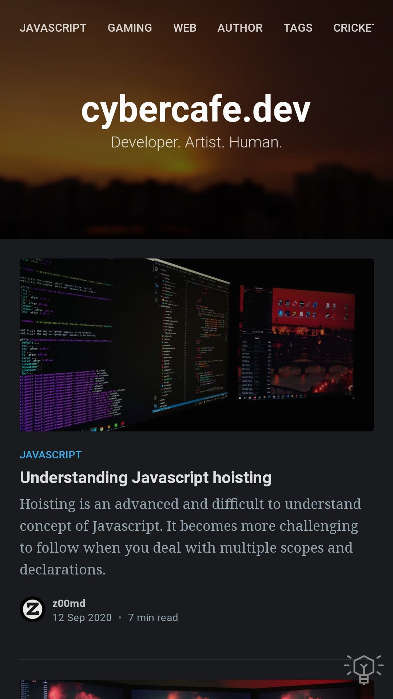
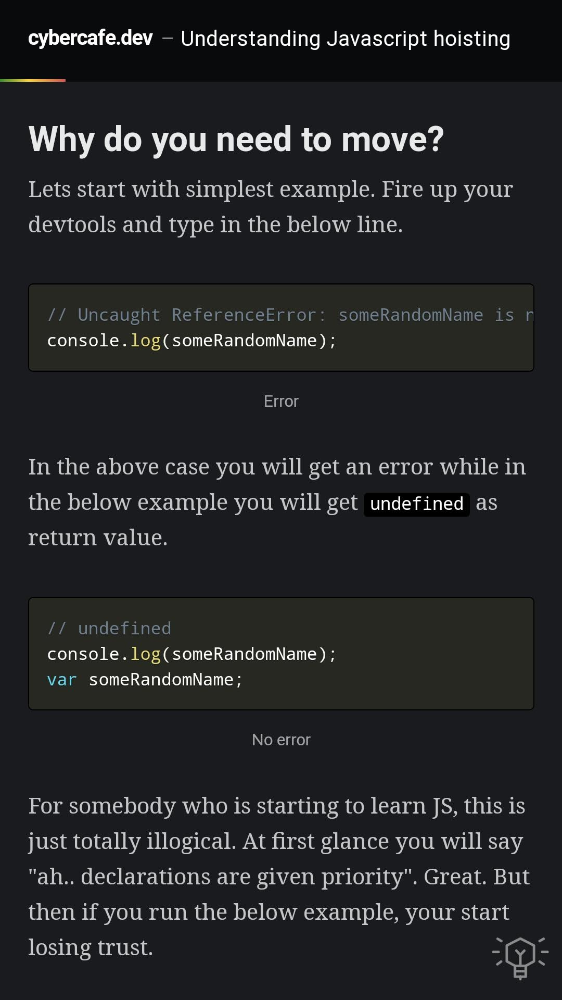
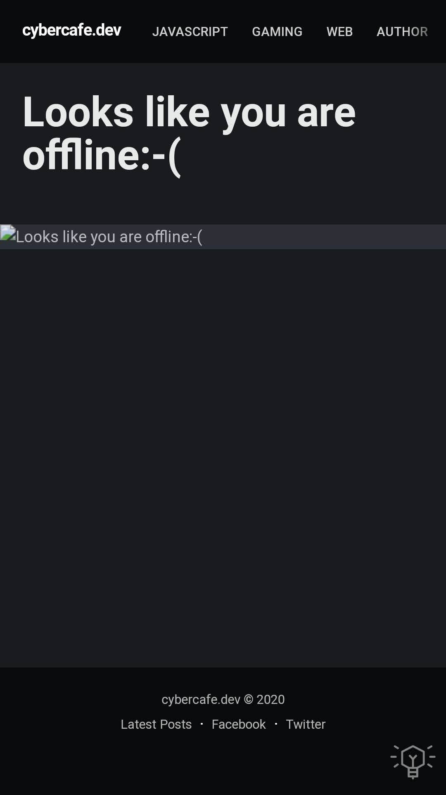
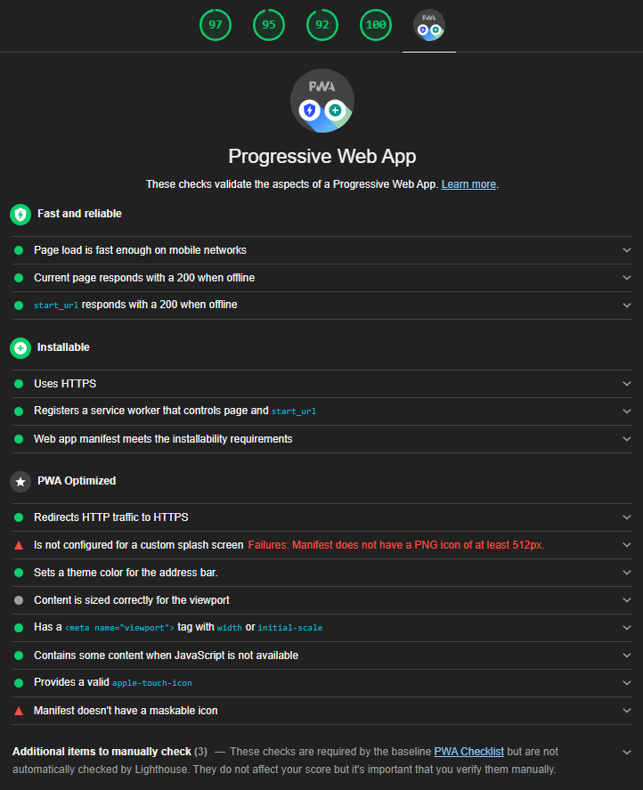

# What is PWA?
Progressive Web Apps are web apps that use emerging web browser APIs and features along with traditional progressive enhancement strategy to bring a native app-like user experience to cross-platform web applications. - Wikipedia

As always, the definition does not serves any purpose in explaining the feature. You need to learn it to understand it.

In simple terms PWA is a technique to make your website behave like an app. To achieve this, you need to use a combination of features provided by the browser and the underlying operating system.

A detailed introduction can be found on mozilla.

https://developer.mozilla.org/en-US/docs/Web/Progressive_web_apps/Introduction

# Getting started
*Since I didn't want to reinvent the wheel, I just copied the code from the below post which I referred to add PWA support on this site.Do check it out for more info.*

https://bironthemes.com/blog/ghost-as-progressive-web-app/

To start with we shall add offline support with a service worker to a ghost installation.

Unlike wordpress Ghost has integrated SEO with a pretty fast nodejs based templating engine. But it does not provide PWA support out of the box. Maybe in future it might come. But for now you have to do it manually.

There are 4 things that you need to do to convert your ghost blog into a PWA

* Convert your site into `https://` if not done yet
* Add a `manifest` file which describes various attributes for your app
* Add a service worker to your site which handles caching
* Enjoy

# Add manifest file
Create a new file in the root of your theme. You can give any name. Most of the options are self-explanatory. Important ones are name and icons. The color will be used as background splash screen while your app opens.

The display property handles how the app should be rendered. It has four options - `fullscreen`, `standalone`, `minimal-ui` and `browser`.

```json
{
    "name":"Cybercafe.dev",
    "short_name":"Cybercafe",
    "description":"A blog by z00md",
    "lang":"en",
    "start_url":"/",
    "background_color":"#ffffff",
    "display":"fullscreen",
    "theme_color":"#313b3f",
    "icons":[
       {
        "src": "/assets/icons/z00md_logo.png",
        "type": "image/png",
        "sizes": "200x200"
      }
    ]
  }
  ```

  More details about properties can be found here

  https://web.dev/add-manifest/

  # Add service worker
  Manifest only provides basic settings for your app. To gain full control of the behavior, you need to manually add a service worker whose task is to determine what to do in case there is no network. 

  To make your site `installable` as an app you need to have a service worker with a `fetch` handler.

  More details available on below page

  https://web.dev/install-criteria/

```js
const PRECACHE = 'precache';
const RUNTIME = 'runtime';

// A list of local resources we always want to be cached.
const PRECACHE_URLS = [
  '/',
  '/offline/'
];

const OFFLINE_URL = [
  '/offline/'
]

// The install handler takes care of pre caching the resources we always need.
self.addEventListener('install', event => {
  event.waitUntil(
    caches.open(PRECACHE)
      .then(cache => cache.addAll(PRECACHE_URLS))
      .then(self.skipWaiting())
  );
});

// The activate handler takes care of cleaning up old caches.
self.addEventListener('activate', event => {
  const currentCaches = [PRECACHE, RUNTIME];
  event.waitUntil(
    caches.keys().then(cacheNames => {
      return cacheNames.filter(cacheName => !currentCaches.includes(cacheName));
    }).then(cachesToDelete => {
      return Promise.all(cachesToDelete.map(cacheToDelete => {
        return caches.delete(cacheToDelete);
      }));
    }).then(() => self.clients.claim())
  );
});

// The fetch handler serves responses for same-origin resources from a cache.
// If no response is found, it populates the runtime cache with the response
// from the network before returning it to the page.
self.addEventListener('fetch', event => {
  // Skip cross-origin requests, like those for Google Analytics.
  if (event.request.url.startsWith(self.location.origin)) {
    event.respondWith(
      caches.match(event.request).then(cachedResponse => {
        if (cachedResponse) {
          return cachedResponse;
        }

        return caches.open(RUNTIME).then(cache => {
          return fetch(event.request).then(response => {
            // Put a copy of the response in the runtime cache.
            return cache.put(event.request, response.clone()).then(() => {
              return response;
            });
          }).catch(error => {
            // Check if the user is offline first and is trying to navigate to a web page
            return caches.match(OFFLINE_URL);
          });;
        });
      })
    );
  }
});
```

# Update `default.hbs`
Now that we have the `sw.js` and `manifest.webmanifest` handy, we need to tell the browser where to look for this. As we do with other resources like `css` we need to create a `link` tag with href to our manifest file. Note that I have shown the `<head>` section only below. Your `default.hbs` would have a lot of other code too.


```html
<head>

    {{!-- Document Settings --}}
    <meta charset="utf-8" />
    <meta http-equiv="X-UA-Compatible" content="IE=edge" />

    {{!-- Base Meta --}}
    <title>{{meta_title}}</title>
    <meta name="HandheldFriendly" content="True" />
    <meta name="viewport" content="width=device-width, initial-scale=1.0" />

    {{!-- Styles'n'Scripts --}}
    <link rel="stylesheet" type="text/css" href="{{asset "built/screen.css"}}" />

    {{!-- This tag outputs SEO meta+structured data and other important settings --}}
    {{ghost_head}}

    {{!-- PWA --}}
    <link rel="manifest" href="/manifest.webmanifest">
    <meta name="theme-color" content="#313b3f">
    <link rel="apple-touch-icon" href="/assets/icons/z00md_logo.png">

</head>
```

We also need to tell the browser to register our service worker and start executing it. For this we can use browser's `navigator` api.

Just goto the end of your body tag and add the below script. `navigator` is a browser api that gives a lot of information about the device, geolocation, cache, storage etc. We will use its `serviceWorker` object to register our `sw.js` file.

```html
    {{!-- Service Worker for PWA --}}
    <script>
    if ('serviceWorker' in navigator) {
        window.addEventListener('load', () => {
        navigator.serviceWorker.register('/sw.js');
        });
    }
    </script>
```

# Create offline page

You need to create a page which will be shown whenever your app is unable to connect to your site. For this you can create a new page under ghost admin. You can edit the page as you like but just keep the url of the page same as what you have given in the service worker.

```js
const OFFLINE_URL = [
  '/offline/'
]
```

# Run it!

Now that everything is setup. Its time to build and run your app. Depending on the build theme and the build tool used by it, you might need to configure `package.json`. For me it worked by default.

If you have a local ghost dev environment running and you have configured it to use local dev theme, you could just run below command and refresh the browser cache.

```sh
yarn dev
```

You can always build your theme and then upload the built version on your local ghost instance or production instance.

```bash
yarn zip
```

If everything runs fine, you should see a new action when you open your site on mobile browser - `Add to home screen`. You will be able to install your site as a native app on your device. And as you open various pages, they start getting cached. Try switching data/wifi off and load your app. You should still be able to navigate to the pages you visited. And for the rest of the URLs you should see the offline page which you created from ghost admin.

. | .
--- | ---
 | 
 | 


# Things to note - My observations : may be wrong

#### localhost is http
Service workers will only work on `https://` sites. And there is only once exception - `localhost`. If you are trying to test whether everything works locally, you need to use `http://localhost:<port>` URL. Other than `localhost` service workers don't work and manifest file is not downloaded. And of course you would also not get any errors. The <link> tag containing the manifest is ignored completely.

### Cache
Once the service worker is registered, it starts caching resources and will always serve from the service worker cache. Note that this is different from your browser based http cache. So even if you disable cache in dev tools, the files will continue to serve from service worker. You need to use the `Bypass for Network` option under the dev tools `Application` tab. You can also use the `Offline` option to simulate no network and test your app.

### Refresh service worker
Did not like the name or background color you gave to your app in the manifest. You changed it, build your theme and disabled all caches but still your changes does not seem to work? I am not sure about the expiry strategy for service workers but as per my observation, it doesn't refresh on disabling cache. You need to `unregister` the service worker to get your changes to reflect.

### What to do on mobile to refresh everything
Its really difficult to test on mobile devices since we don't have dev tools where we can just disable cache for that one particular tab. Also once you have installed the web app, its no longer a browser cache that needs to be cleared. For me I had to goto app manager on android and remove the data/cache from settings menu to get it to refresh. And of course you would need to clear your browser cache as well, otherwise your browser will just use its cached version and you will still not get your changes.

Few steps that helped me troubleshooting on mobile 
* Uninstall app
* Clear storage and cache for your app on android under settings
* Clear browser cache from browser settings for your site
* Reload in browser 
* Again add your app to home screen via browser menu

## Further reading

Refresh service worker on demand

* https://deanhume.com/displaying-a-new-version-available-progressive-web-app/
* https://forum.ghost.org/t/progressive-web-app-version-of-ghost-blog-install-service-worker/2013/12

# End note



Progressive web apps is not just one property. Instead it is a set of techniques combined together to create a seamless user experience. Its still developing and will sure change in near future. Needless to say, not every platform supports every feature. Just be cautious about it.

# Update on 13 Sep 2020
Because of the `cache first` strategy used in the service worker, I was having many issues
## New articles won't appear
This is due to the fact that Homepage was served from cache always. To overcome this, I updated the service worker to use `Network first` strategy which means show cached files only when network call fails. And present an offline page if both fail.

This strategy has one disadvantage though - You need to wait for the network call to finish which loses the blazing fast caching feature. I guess, a cache first strategy will be more effective. Will try that out later.

## Ghost admin going into 500 errors
This might be happening because all GET calls were being served from cache with inconsistent data.

I added a check in the service worker to ignore all admin calls

```js
// The fetch handler serves responses for same-origin resources from a cache.
// If no response is found, it populates the runtime cache with the response
// from the network before returning it to the page.
self.addEventListener('fetch', event => {
  // Skip cross-origin requests, like those for Google Analytics.
  // Skip all ghost admin requests to prevent 500 errors
  if (event.request.url.startsWith(self.location.origin) &&
      !(event.request.url.startsWith(`${self.location.origin}/ghost}`))) {
    event.respondWith(
      caches.match(event.request).then(cachedResponse => {
        return caches.open(RUNTIME).then(cache => {
          return fetch(event.request).then(response => {
            // Put a copy of the response in the runtime cache.
            return cache.put(event.request, response.clone()).then(() => {
              return response;
            });
          }).catch(error => {
            // Return cached reponse if network fails
            if (cachedResponse) {
                return cachedResponse;
            } else {
                // Return offline page if network and cache both fail
                return caches.match(OFFLINE_URL);
            }
          });;
        });
      })
    );
  }
  ```

  > End

