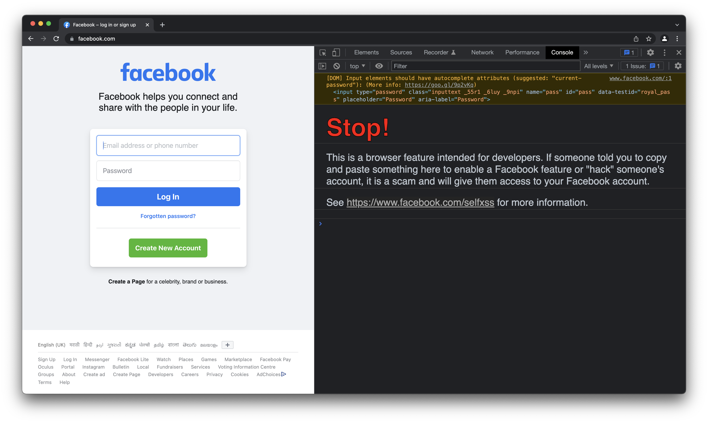
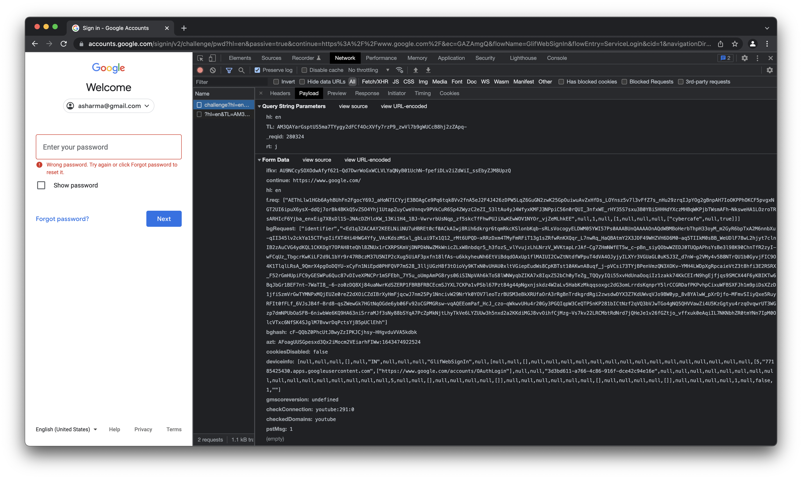
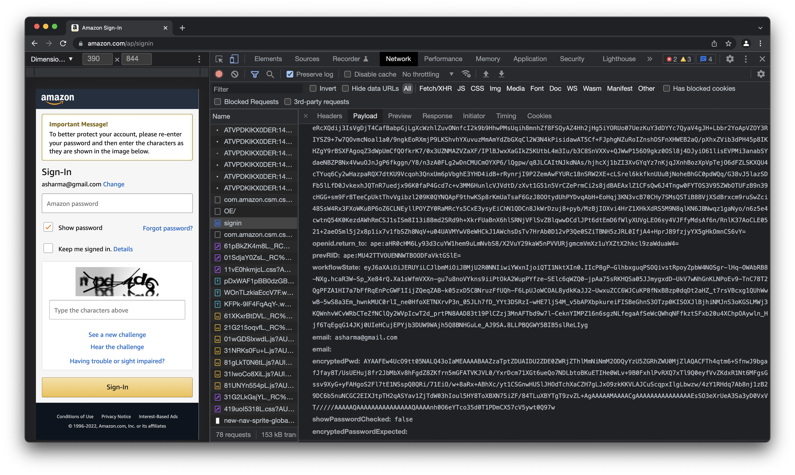
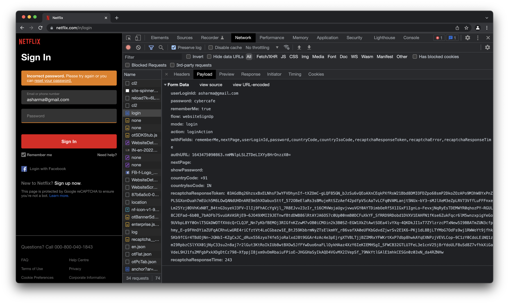
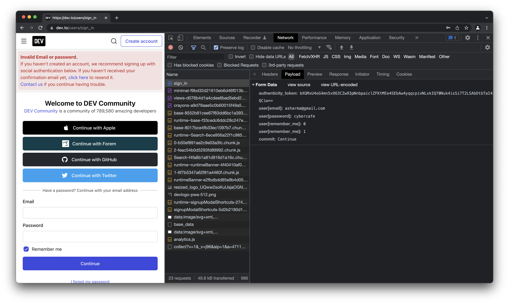

# Need
In one of my earlier posts, I covered  the difference between [authentication and authrorization](https://cybercafe.dev/authentication-vs-authorization/). Authentication is one of the most important aspects of web but is somehow strangely not in built into the web we use nowadays. It needs a lot of effort just to add auth to your website, let alone the security of the system. I am always fascinated by how different websites try to secure the communication to make their platforms less susceptible to attacks. Obviously there is no one golden trick that can do that. You have to employ a plenty of different ways to prevent attacks. Let's try to understand how auth works in simple terms and what all companies are doing to secure there auth systems.

# Intro
Authentication seems simple at first but a lot happens in the backgound when you click on the login button.

# The Illusion of session
Once you login into an application ~~using~~ your username and password, any page/link that you were not able to access before, now becomes accessible. For stateful protocols(connections that make a tunnel from your computer to server), its just a matter of keeping a connection open always just like how it used to be with landline phones. When you called somebody, a line was dedicated for that particular connection. But for most of the web, the underlying protocol is `HTTP` which is `stateless`. Which means that every request is independent and there is nothing in the connection that identifies who created the request. 

So if you login on chrome and firefox with different accounts on the same computer, and you visit your settings page, you are actually requesting the exact same page.

For the server these are just same requests coming from the same IP address and it cannot differentiate who initiated which request. But still somehow the correct page opens up in each browser.

The magic is `session-id`.

Every request that goes to the server contains a special value called session identifier which identifies who requested that page. The server compares it with its stored value and depending on that it returns the page. But then the question is where this value came from.

The jist is that every request needs to be authenticated. There are two ways to achieve this
* Pass Credentials in every request
* Pass a mutually agreed key in every request

Passing credentials in every request is not a good idea. You will have to ask username/password on every page which obviously nobody will like. You can always also save the credentials in browser storage like session storage or local storage but those are not the secure ones and potentially can cause more problems then solving the session issue. Moreover these apis came in later and the web already evolved with existing methods that were available at that time.

So the web guys came up with a mechanism called `token`. On the first request which has your username and password, the server generates a fresh random string and sends back to the browser. The browser then stores that string into its memory(In [cookie](https://en.wikipedia.org/wiki/Magic_cookie), not [cookie](https://en.wikipedia.org/wiki/Cookie)). For each subsequent request to the same domain(that is important!), the browser sends the stored `token` everytime. And yes everytime is again very important. 

In simpler terms, each page request(or api call if you work in SPA) needs its own authentication which is kind of overhead but thats how the protocol works.

> Thats how the users see it as session while in the background there is no such session.

# Session Id
Mostly, the id we discussed in the above section is just a random unique value and nothing else. Unique only for the time its associated with your profile. Once it expires, it could repeat with other user's profile value. But of course, at that time you won't have the previous values with you. On every login, the server creates it and keeps a copy of 
it for validating future requests. The copy is maintained for a predefined period of time as per the server's policies. And that's why your session expires if you do not do any activity for sometime.

So, if somebody, somehow manages to get your `token`, he/she/they can recreate your session in their computer. Without knowing the username/password the attacker is able to access your data. This technique is called [session hijacking](https://en.wikipedia.org/wiki/Session_hijacking) and can easily be done if you are not connected via SSL connection. Anybody who can intercept your http request will be able to see your session id. How `SSL` prevents your request from being read by interceptor is a separate topic(infact a book) of discussion.

> Take your sessionId as seriously as you take your password.

# HTTP authentication

The HTTP protocol defines how each request should be [verified or authenticated](https://developer.mozilla.org/en-US/docs/Web/HTTP/Authentication#authentication_schemes). But again its upto the server(the guys who create the servers) to implement how do they want to authenticate each request.

You will find many schemes listed in the page, but most common ones are `basic` and `bearer`. You can read about them on the MDN page. But in simpler terms
* **basic** - provide credentials with every request
* **bearer** - provide a token with every request

Basic auth is suitable for requests which generally will not have follow up calls. Like downloading a protected file on the internet. 

Bearer auth means that you will provide a token which server can validate. Of course, the token generation will need you to have the username/password in the first place. But once you get the token, you no longer need to pass in your credentials everytime.

There is even an already defined [header](https://developer.mozilla.org/en-US/docs/Web/HTTP/Headers/WWW-Authenticate) in http protocol which says what all schemes are supported.

But again, its upto the server to manage how the authentication is done. Big companies like facebook, netflix will have many layers of protection to avoid authentication breaches.

# Encrypting password before sending
I recently observed that a few sites encrypt the user password using [browser apis](https://developer.mozilla.org/en-US/docs/Web/API/SubtleCrypto) before sending it to the server even if you are on a SSL connection. Of course not everybody is doing that. The question is why do you need to encrypt your password if you are already on `https` connection which means that every request is always encrypted.

I am not sure about the use case of this approach and there seems to be very [less information](https://duckduckgo.com/?q=encrypt+password+before+sending+to+server&t=brave&ia=web) about it available online. There are few [outdated debates](https://security.stackexchange.com/questions/133453/is-encryption-of-passwords-needed-for-an-https-website) but I didn't find any strong evidence to support browser based password encryption.

What I feel is - this helps in preventing credential theft from other techniques like installing malicious browser extentions. Sometimes people are also tricked into running javascript code which can inject functions in background and can intercept the login call even before its encrypted by the TLS session.

Thats why you see a big warning when you open `console` on facebook.com.
 
Though the attackers are not totally wrong! At least someone is getting hacked :-P

Here are some examples of how popular sites are sending user credentials to the server. Using a random username `asharma@gmail.com` and `cybercafe` as password. These are not actual values and of course will always lead to error.

* **Facebook** - encrypts password using [tweetnacl](https://www.npmjs.com/package/tweetnacl). It also appends the timestamp(epoch) which changes the encrypted text everytime. 
  

* **Google** - encrypts the password and its not even clear which field contains the password
* 

* **Amazon** - encrypts and sends the password in the encryptedPwd field in the form
  

* **Flipkart** - keeps it simple. The authentication is via a rest call `https://2.rome.api.flipkart.com/api/4/user/authenticate` without any encryption. In fact they keep the fieldNames also pretty clear. 
  

* **Apple** - also sends the credentials in plaintext. For some reason they send the "remember me" setting in query params as well as form. And the value is different in both. Not sure why are they doing this.
  

* **Twitter** - works like a SPA and everything is an api call unlike amazon. They might have some kind of task manager in the backend. `Login` might be just another task with some input. And yes, they don't encrypt password, but they don't send the password with the username. Insted they create a pre-auth token for the user and then send password with that token. The token then identifies the user in the backend and authenticates the user with the password.
  

* **Netflix** - No encryption on creds and also mentions clearly what all fields are getting passed with a `withFields` param.
  

* **Steam** - Being a very popular platform, they do need to take utmost care. They also encrypt the password. Not sure which algorightm they use.
  

* **Cybercafe.dev** - Well, since no one logs in to my blog other than me, there is no need to add overhead to encrypt password on browser. In fact this is not something that I can work on. This is something that the platform manages. In my case it is [Ghostjs](https://ghost.org/docs/staff/) Of course, the connection is over SSL so I am covered with the basics.
  

* **Dev.to** - does not encrypts the credentials, but they do have some additional authenticty token. Rest everything goes plaintext.
  

# JWT, sessionId, hash
JWT has gained popularity in recent years. Its another way to solve the authentication problem. As per their [intro page](https://jwt.io/introduction), JWTs use encryption and are more secure than your normal session identifiers. After doing some research and reading their doc carefully, what I understood is that your jwt is as much vulnerable as regular sessionIds. 

Though there is another advantage of using JWT but that again becomes a topic of another article(link will come here once I finish that).

At the core all these methods are just creating a token which the client(browser) stores temporarily and sends back with each request so that the server can determine from whom the request is coming and thus what to respond.

# Multi factor authentication
Whenever you are required to enter an OTP even after providing the correct username and password, you are using a variant of MFA. As its name suggests, MFA means authenticating the user by asking for another key other than the password.

Even in MFA, once a user is authenticated, the rest of the flow is same. After initial authentication, a token is generated and is used for subsequent requests which is similar to how regular logins work. So, in case your session is compromised, the attacker can gain access to whatever you have access to.

In some cases even 3 factors are used for initial authentication. Remember that the factors need to be independent of each other. Having two passwords on the same screen is not 2 factor authentication. The other password needs to come from another device other than user's memory. 

# SSO - Single Sign On
The term says, you sign in once and then you no longer need to sign in again. So how is it different than the regular sign in process using sessions? Isn't that also a single sign on. You are effectively signing in just once, for all subsequent requests, you don't need to enter credentials.

Regular sessions work for logins on one website. If you try to access another website even if it is controlled by same organization, you would need to enter your credentials again.

This used to happen in the past when google products were on different domains like `google.com` and `google.co.in`. You login on one site won't work on another. So they implemented SSO which means if you were logged into `gmail.com` you can navigate to `google.co.in` and you would not be required to enter login creds again.

SSO solves this by doing additional tasks. In the backend the sites are interconnected and a token is generated which is shared by different sites in the backend.

> End

