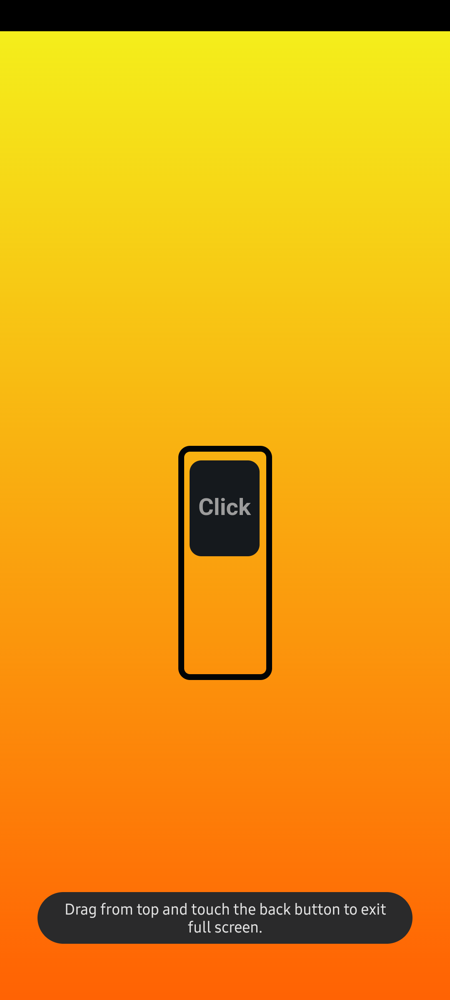

# Demo
You can see a quick live demo [of a a simple utility to have black screen when needed](https://cybr.cafe/black/). Long time back I did some experiment with [styling native checkboxes](https://cybercafe.dev/styling-native-html-checkbox/). After learning about fullscreen, I enhanced it with fullscreen enabled. A quick demo for it is available [here](https://cybr.cafe/styling-native-checkbox/).

| Regular view                             | Fullscreen view                                     |
|------------------------------------------|-----------------------------------------------------|
|  |  |

# Why fullscreen?
Obviously not every app needs to go fullscreen. Generally apps dealing with videos like YouTube, vimeo, Zoom etc. need fullscreen support. Sometimes you have a peculiar requirement, and you need to solve it with what you know.

I work on multiple monitors simultaneously for productivity(and gaming :-P), but sometimes I just want to focus on one screen and keep the other one standby. Having a window in the other monitor shines right at your face distracting you specially at night.

Switching monitor on and off is a pain because of the whole layout changes, and then I have to resize every window.

So I created a teeny tiny [page](https://cybr.cafe/black) which opens up a complete black page. While it works but there was one issue. The title bar still distracts, and it would be great to have whole screen black. Thus, the need for going fullscreen.

# But How?
So the next question is how do you make the website go fullscreen? Since many other apps like YouTube already have this functionality, so I assumed this is already supported by browsers, and you just need to call its api. The only thing that concerned me was whether it is an easy task like calling a function or a complex one like [downloading a file](https://cybercafe.dev/complete-guide-to-file-download-in-browsers/).

It turns out that we just need to use the `element.requestFullScreen()` api to go fullscreen. As its with other apis, there are some options and some restrictions with this.
This api `requestFullScreen()` can be called on any html element depending on some limitations

* It must be one of the standard HTML elements or `<svg>` or `<math>`.
* It is not a <dialog> element.
* It must either be located within the top-level document or in an `<iframe>` which has the `allowfullscreen` attribute applied to it.
* The important one is that [Transient user activation](https://developer.mozilla.org/en-US/docs/Web/Security/User_activation) is required. The user has to interact with the page or a UI element in order for this feature to work. This restriction if not present can enable anybody to just open a site fullscreen in the background and can confuse users.

# Show me code < >

* First get the element you need to make fullScreen.
```javascript
let elem = document.querySelector("video");
```

* Get the `documentElement` if you want the whole page to go fullscreen
```javascript
var elem = document.documentElement;
```

* Call api on that element. This function returns a promise which resolves if fullscreen request was successful or rejects if somehow its wasn't
```javascript
elem.requestFullscreen();
```

* Just to be on the safer side you can detect and call
```javascript
if (elem.requestFullscreen) {
	elem.requestFullscreen();
} else if (elem.webkitRequestFullscreen) { /* Safari */
	elem.webkitRequestFullscreen();
} else if (elem.msRequestFullscreen) { /* IE11 */
	elem.msRequestFullscreen();
}
```

# Exit fullscreen
Once an element goes fullscreen you need a way to come back to normal view otherwise the universe will be full of fullscreen windows.

```javascript
document.exitFullscreen();
```

And of course you may need browser based detections
```javascript
if (document.exitFullscreen) {
	document.exitFullscreen();
} else if (document.webkitExitFullscreen) { /* Safari */
	document.webkitExitFullscreen();
} else if (document.msExitFullscreen) { /* IE11 */
	document.msExitFullscreen();
}
```


> End