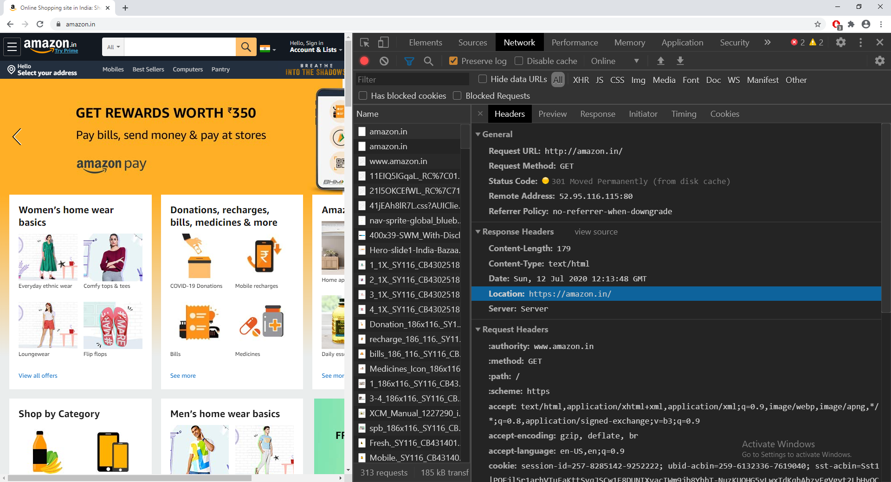
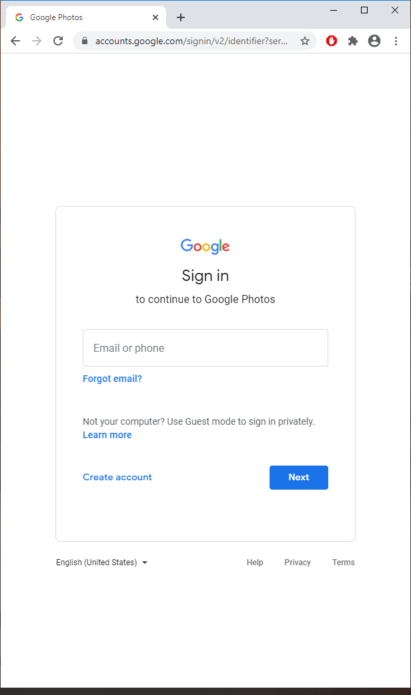
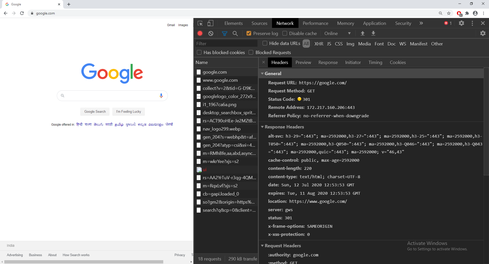

# What is http, https and why some sites start with www?

Do you often ask yourself below questions when someone requests you to open a website? Hey buddy, quickly logon `trymywebsite.com`, there is something interesting.
* Should I start with http:// or https://?
* Do I need to put a www before the website name?

And if you don't have answers to above questions, your best bet is to just write the website name as it is in the URL address bar and hope **google** will figure out the correct link for you. Well for popular sites this is fine, but for sites which are very new, google would also not give you proper links.

If you are into web development, you know the drill. You might as well be aware of redirects and the ever inessential `www` for every website. In this article I will try to answer the questions in simpler terms for people who are not developers. I will also try to explain in brief `why` and `how` of these terms.

# http:// vs https://
Although there is only a small variation of one character `"s"` between these two, there is a very big underlying **difference**.

To start with, both are just protocols which basically say that I want to initiate an http based connection. You can start a connection from a browser, an app, maybe an embedded device etc. For more technical details see below link.

https://www.computerhope.com/jargon/h/http.htm

`https://` was introduced later when the web started using encryption. The `s` literally means `secured` and is implemented using public key cypher. What this means is that whatever you send from the browser to the server and any data that comes back to you is encrypted. Nobody in between can hijack your packets and read data until he has the key to decrypt. This whole setup is done using a technology called `SSL - Secure Sockets Layer`. The concept is : You create certificates with public and private keys. Encrypt the data with public key and decrypt with private key.

Of course, everything comes at a price. There is a small fee that incurs when you add `SSL certificate` to your site. There will be different certificates for different sub-domains and with it you need to manage the certificates by yourself, their renewal etc. This all brings in a significant cost to the service.

Learn more about https here - https://www.cloudflare.com/learning/ssl/what-is-https

Google has recently made a change to their browser chrome where secured sites will have a padlock icon while insecure sites will have a textual warning saying `Not secure`. Every browser has a different way to notify this.

### An example of secure site

### An example of insecure site

In a nutshell, if you are doing any financial transaction, or if you are logging into any application using username/password or if you are entering any personal information such as phone numbers, email, address etc make sure that the site is secured. Since this is being followed by almost everybody on the internet, its assumed that every big organization will have a `https://` connection. 

This is the first rule of internet security - ==NEVER== enter confidential information on insecured sites. Even if its a known site like *facebook.com*. If the padlock icon is missing, it means either somebody has already `hacked` you or your internet connection(router) or there is something wrong with facebook's servers. Maybe an ongoing attack.

In some cases it is ok to browse insecure sites unless the are not asking any personal data. This can be observed frequently with government websites even though the Indian government has a dedicated IT team for all gov sites. We need to improve on this asap.

Now you understand the risks, we can put a benign answer to our question. Yes, `http` and `https` are different. You need to know beforehand which one to use. So you need to ask the person who has given you the site to open - Is it secured or insecured? 

And this becomes cumbersome if you ask everytime what should I use, To overcome this there is a small trick that has been going on for decades which saves you from all this trouble.

# The magic
Redirect all requests for `http://` to `https://`.

If you type in just the insecure URL in the address bar `http://cybercafe.dev`, the request goes to the server which in return responds with a message to your browser loosely translated as `Hey browser, I have my site setup on a secure channel, Please re-direct every other request to it and make sure to follow this for future requests as well`

Because of the above procedure, your browser will then automatically redirect from `http://amazon.in` to `https://amazon.in`. This happens in the background and is so fast that as a user you won't notice it.

We can also observe what all requests the browser sends using a browser Dev tool. Checkout the above screenshot. You can see that even if you type `http://amazon.in` the browser initiates a request but in the response, the server says that please goto `https://amazon.in`. This information is present as a `Location` value as highlighted under the Response Headers section.

This behaviour is server dependent and can change how site owners configure their websites but we can easily say that 99% of the sites use this technique.

# What about the promiscuous www that we used to put before every URL?

Now coming to the second question. Do you need to put in `www` before the sitename? Sometimes you might have also seen `ww1` or `ww2` or some other crazy prefixes added in the sitename like `wwwhome.somewebsite.com` or commonly seen `accounts.google.com` or `maps.google.com`. In these types of URLs there are some distinguishing names
* Top level domain - `.com`
* Second level domain - **`google`**
* Subdomain - `accounts`
* Path - /signin/v2/identifier?service=lh2&passive=1209600&continue=https%3A%2F%2Fphotos.google.com%2Fu%2F3%2Falbums&followup=https%3A%2F%2Fphotos.google.com%2Fu%2F3%2Falbums&flowName=GlifWebSignIn&flowEntry=ServiceLogin

By looking at the URL you can instantly say that you are on the account section of `google.com`. As a user it doesn't make much difference but technically `google.com` and `accounts.google.com` are two completely different websites. 

These variations of a site are called **subdomains**. This is done to segregate various independent features. For eg. *ads.google.com* is totally a different application where you can manage Advertising.

One more thing to note is the path which contains a pretty long string having some encoded text. In this case the path has more information like from where did the user come from and to where he should go next etc. In some cases these two can be hosted on different servers with different security mechanisms. 

Coming to the point, `www` is a subdomain of `google.com`. So basically `google.com` and `www.google.com` are two different websites. But still as a user you don't see any difference. Whatever you type in the URL, you always land on the same site. Remember the re-direct trick mentioned earlier. Website owners do the same magic and setup routing to re-direct the user to the default working site.

Graphically speaking
`https://google.com` -> `https://www.google.com`

Also remember that the redirection can be setup as per liking of the website owner. There is no rule that the default site should be `www.google.com` or `google.com`. In my case I opted for `cybercafe.dev`. The  prefix `www` just feels redundant to me.

Since I have not yet setup the `www` redirection yet, if you try to open `https://www.cybercafe.dev` right now, you might see that it doesn't work. Will do that in a few days.

One more thing - Remember our SSL certificates we talked about. Every subdomain has a different certificate. Its quite possible(although highly unlikely with big brands) that `amazon.com` is secure but `payment.amazon.com` is not and you might see a warning for it. If this happens, you need to be extra cautious. It might not be a hack but prevention is better than cure. And you know; On the internet, once you lose money, there is only `.1%` chance that you will get it back. Its really difficult to track attacks and requires highly trained professionals to remediate those.

So basically in other words all these are different websites. Its just about the server configuration that helps(read as fools:-P) you in connecting to one site using other URLs.
* http://google.com
* https://google.com
* http://www.google.com
* https://www.google.com

A question would come to your mind, if every connection from the browser is http based, why do we need to put it explicitly? This goes long back with a gangling history. For now just lets just say that browsers provide you an opportunity to connect with different protocol if required. Maybe in future the browser vendors remove this and only show you the site name. Instead of showing `https://cybercafe.dev` they can just show `cybercafe.dev` with a secure icon.

If you are interested to read more in depth, checkout below links

* https://web.dev/why-https-matters/
* https://www.globalsign.com/en/blog/the-difference-between-http-and-https
* https://www.entrepreneur.com/article/281633

> End

