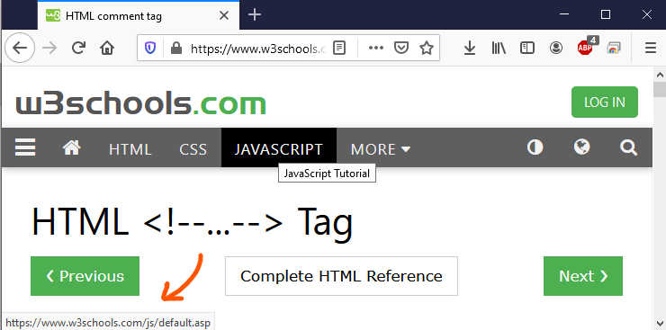
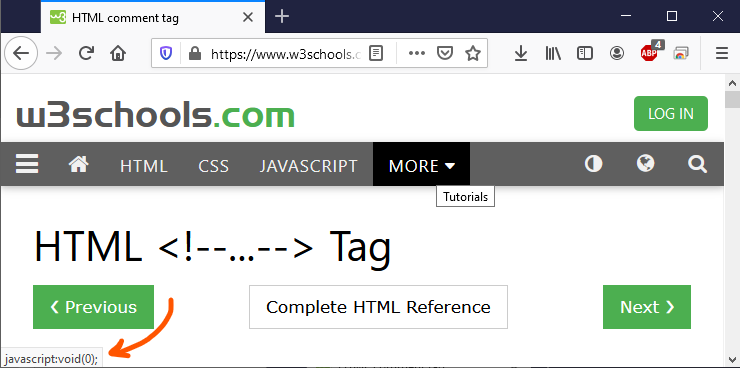
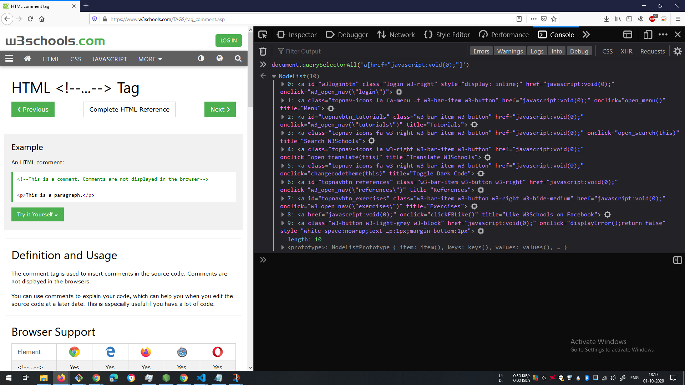

# Where have I seen this?

Even if you have not worked as a front-end engineer, you might have seen this quirky syntax somewhere.

Lets take the example of `w3shools.com`.

When you hover over on menu items at the top, some browsers will show a preview of the link at the bottom left. But for some menu items instead of the link you will see `javascript:void(0)`.





# Lets Inspect</>

If you try to inspect the element in Dev tools, you shall see that the `href` itself is set to `javascript:void(0)`.

And if you look around the DOM, you will find that there are many `<a>` tags which have href set to this.



# Reason?

The aim is to do *nothing*. Yes, literally speaking this is the actual requirement. Though `<a>` tags means that it should lead you to some place either in the same page(# based routing) or to a different page. This is how links work in html.

But having Javascript in hand, people added their own interactions. Even doing something like this

```js
// function to redirect to user details page
function gotoUserDetails() {
	window.location("http://somesite.com/user/1234567890");
}
```

Adding actions to buttons and other tags was fine. But adding a custom action to the `onclick` event of an `<a>` tag results into two things. 

Your function would run, but by default the browser would also navigate to the link that is present in the `href` attribute.

# Just use empty string for href?

You can always just pass an empty string to the `href` attribute and let the js function run to navigate the user.

The problem is that empty string is still a valid URL somehow. And passing an empty string means, the browser will reload the page and will also prevent your function to run. The only way browser won't do nothing, is to return `undefined`. This can be done using a custom javascript code which returns `undefined`.

```html
<a class="w3-bar-item w3-button" 
   id="topnavbtn_tutorials" 
   href="javascript:void(0);" 
   onclick="w3_open_nav(&quot;tutorials&quot;)" 
   title="Tutorials">MORE 
    <i class="fa fa-caret-down"></i>
    <i class="fa fa-caret-up" style="display:none"></i>
</a>
```

And this is one of the ways to get `undefined` value. Note that we want the `undefined` value and not `"undefined"` string.

```js
// Returns undefined
void(0);
```

# Why void(0)?

You can very well ask then why not just return `undefined` directly?

```html
<a href="javascript:function() {return undefined};">Link</a>
```

This leads us to another quirk about JS. Though `undefined` is a special type having a special value, the global property `window.undefined` is just another regular property on window object.

In earlier version of JS, this could be overwritten with something like this.

```js
window.undefined = "https://thisisbad.com";
```

So it was not always the case that `window.undefined` will be `undefined` in global scope. Albeit this is now fixed. If you check the property descriptor of `undefined`.


But there is still one issue with `undefined`. Its a valid identifier and can be used as a parameter within a function. So if you do something like this, you can have a different value for `undefined`.

```js
// returns "Wooaaaahh! Happy?"
(function (undefined){
	// undefined is just another parameter here
	return undefined + " Happy?";
})("Wooaaaahh!")
```

`void` is a special operator that always returns `undefined` after evaluating the expression as the operand.

So gradually `void` became the only way by which  `undefined` was guaranteed.

# But why 0?

`void` is just a unary operator which will work on the operand on the right side. We can also write `void 0` instead of `void (0)`. The parenthesis are just to group the expression and are used as a best practice.

You can also use any of the below methods to achieve the same result. The `0` in the expression is meaningless. Only the expression should be a valid one.

```js
// Everything returns undefined
void 0
void (0)
void (1)
void true
void (typeof x)
void "Are you ok?"
void (1,2,3)
void (()=> {})
```

### Further reading

* [MDN article](https://developer.mozilla.org/en-US/docs/Web/JavaScript/Reference/Operators/void)
* [Some more interesting discussion](https://stackoverflow.com/questions/1291942/what-does-javascriptvoid0-mean)

> End