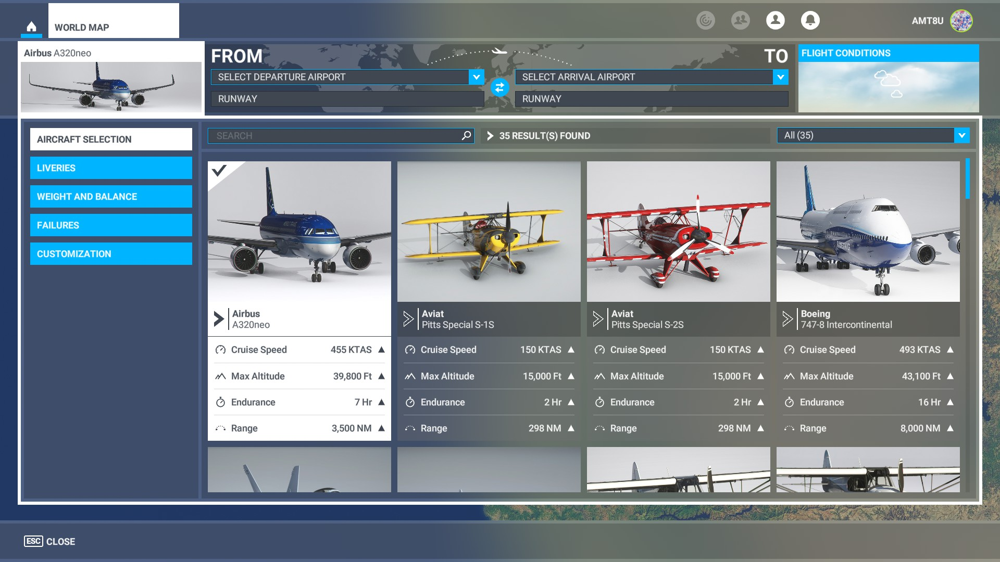
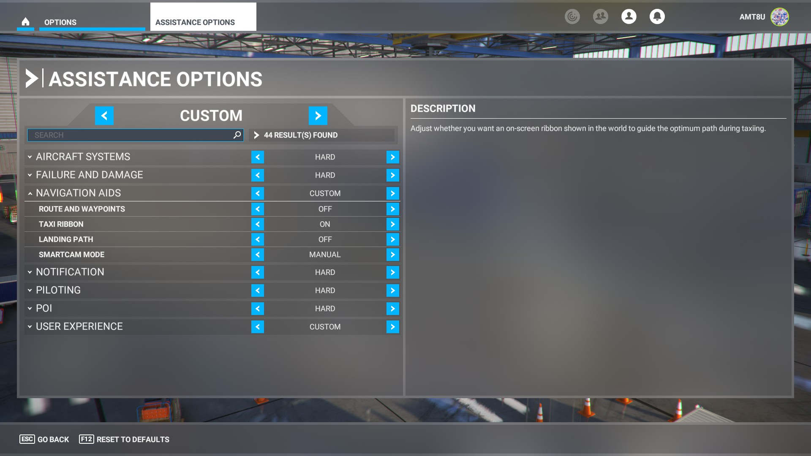
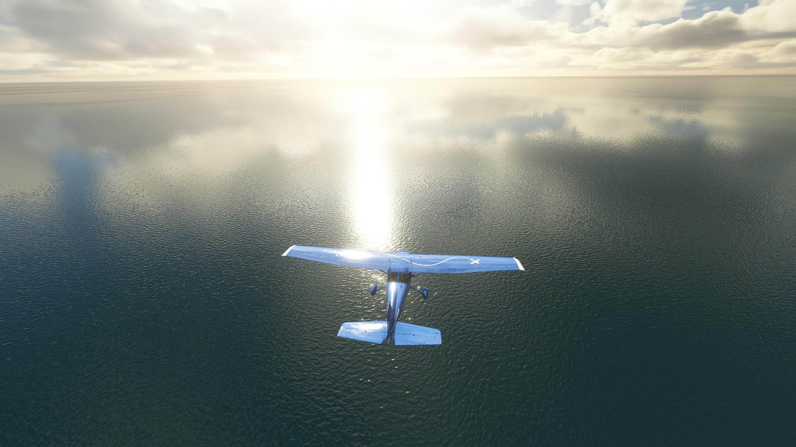
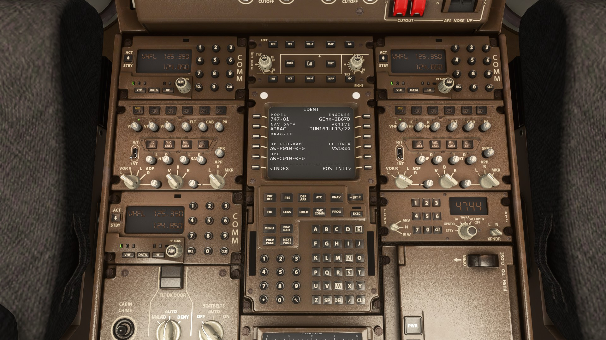
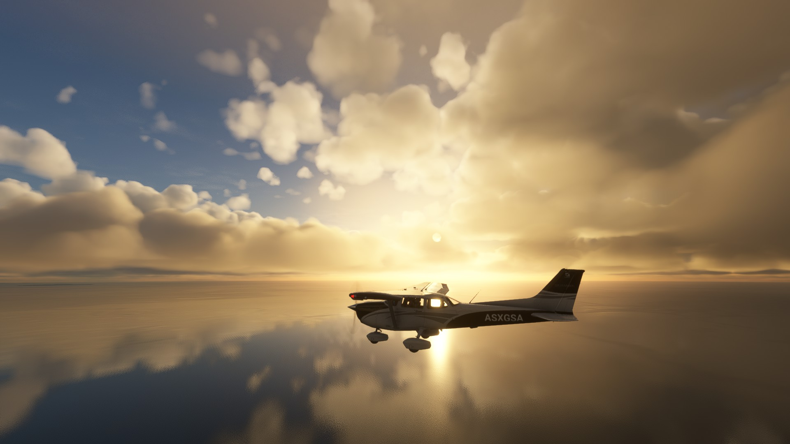

# Why
As soon as I finished [building my PC](https://cybercafe.dev/building-a-gaming-pc-in-india/), I wanted to try out a flying sim, but couldn't afford purchasing one. I did try my hands on the free ones like DCS but it didn't have the kind of flying I wanted to learn. It's somewhat good as a free resource(two aircrafts with base game) but lacks anything in terms of training the digital instruments.

Although I have good experience of flying in gta and battlefield, but that doesn't count when you are flying in a simulator. These games are nothing compared to real life flying. To compare; in Airforce you need to [clear a PABT test](https://byjusexamprep.com/what-is-pabt-test-in-indian-armed-forces-i) thats harder than GTA or any arcade flying game.

I was always fascinated after watching movies like [sully](https://www.imdb.com/title/tt3263904/) and [flight](https://www.imdb.com/title/tt1907668/) and was curious to know, why there are like hundreds of switches on the panel? Moreover, movies on flying don't do justice in explaining them. Nevertheless, I got my first joystick [Logitech extreme 3d pro](https://www.logitechg.com/en-in/products/space/extreme-3d-pro-joystick.942-000008.html) which I suppose will help in learning flying. I Highly doubt its pro-ness but seems to be a good starting point.

I know flying an A320 is not a simple task and it takes lot a of training and money to reach that level and no simulator can give u the hands on experience, but hey, at least I know [what APU means](https://www.youtube.com/watch?v=xEDlMiFGleY).

There are some other flying games but they dont have any good training sessions and interface is somewhat difficult. Here is a list of some flying games/sims I tried or know of

* **[Sturmovik IL2](https://store.steampowered.com/app/15320/IL2_Sturmovik_1946/)** - No training and straight forward lands you in combat. May be meant for the ones who are already skilled in flying.
* **[Ace combat](https://store.steampowered.com/app/502500/ACE_COMBAT_7_SKIES_UNKNOWN/)** - Arcade game with better graphics
* **[X plane 11](https://store.steampowered.com/app/269950/XPlane_11/)** - Yet to try, but reviews say that its more realistic than MSFS but with worse graphics
* **[Aero FS](https://store.steampowered.com/app/434030/Aerofly_FS_2_Flight_Simulator/)** - Same as X-Plane
* **[DCS](https://store.steampowered.com/app/223750/DCS_World_Steam_Edition/)** - Focuses on combat and expensive Jets
* **[Microsoft Flight Simulator](https://store.steampowered.com/app/1250410/Microsoft_Flight_Simulator_Game_of_the_Year_Edition/)** - A balance between graphics and realism. Base game is a little expensive, but includes many aircrafts and airports around the world.

# Microsoft Flight Simulator X

Being a very cheap option, first I purchased MSFS X on steam. Tried it out but, being an old generation game the graphics were not what I had in my mind. After waiting for some sale on steam, I got the [MSFS 2020](https://www.flightsimulator.com/) standard edition in `3k($75)`. It brings in the best combination of graphics and simulation.

# Microsoft Flight Simulator 2020
Here is a quick summary of what I liked about the simulator

* **Training** - Several tutorials which start from very basic to IFR flying. There is a lot of scope here though. They can add more advanced tutorials on instrument and cockfit learning. Alternatively there are some more training options which you can purchase via [FS Academy](https://www.aerosoft.com/us/microsoft-flight-simulator/msfs-tools/3325/fs-academy-vfr-msfs) but not sure how good they are.

* **Inventory** - The good thing is that in the standard edition, a large number of planes are available from your basic cessna to Boeing 747. Many of them are fitted with latest Garmin G1000. And of course, there is a market place where you can buy whatever you want.

* **Indian airports** - Couldn't check many airports, but I can see that even airports from small cities are present. Although I can't certify their accuracy in terms of the approaches and buildings, but you can recognise buildings while flying around in the city. Also, I cannot verify the level of details as I was unable to run MSFS on Ultra quality. In fact on Low and Medium I get around 30-40 fps only.
* **Assist options** - There are many assist options available. You can configure whatever you want. But once accustomed, I would highly encourage to switch off them and be the real pilot. I am still learning taxiing, and thus enabled only that.

* **Graphics** - The best thing about this sim is the graphics. From certain angles, sometimes it becomes diffcult to distinguish if its a screenshot or an actual photo.

* **Weather** - With so much details on aircrafts and scenery, its expected to have a good weather system. Although I can't comment on the accuracy but it does have a intuitibe setup where you can create custom weather situation like heavy clouds with storm etc.

* **Istrument panels** - Again, for a person like me, the panels look real and functionally work properly too. 

# Can I fly?
Apparently with only a few sessions, I learned so many things that I could now appreciate the details in [7500](https://www.imdb.com/title/tt6436726). One of the things I learned is that you need good amount of training to even use the auto-pilot. Some how its not so much automatic what people may think. There are many variables which decide what auto-pilot option you need to use. And with each failure, the variables change exponentially.

Here are some things that I learned

* **VFR Flying** - Visual Flight Rules : When you are navigating by looking out of the cockpit and visually identifying the landmarks.
* **IFR Flying** - Instrument Flight Rules : When you can't see outside, maybe because of weather, and navigate using the instruments, you do IFR. This is what I wanted to learn. Understand what all indicators on the flight displays mean. This will take a while but the journey is quite enjoyable.
* **Auto Pilot** - Auto pilot is about managing the altitude and speed. It seems easy that you just rotate the dials to your specified values and let the plane do the work. But there are a few actions that you need to take before auto-lipot can help you. For eg. set altitude won't work unless you specify and `VS`(Vertical Speed). There is also one important thing - Throttle. Some planes have auto throttle while the basic ones don't and you have to manage the throttle. Think of the auto pilot as a helper which tries to guide you and not forces. Looking outside is one thing, and looking at the flight display is another. You need to understand what each line means.
* **ATC Comm** - You must have heard the simplest of instructions like *maintain heading 070* but there is a complex set of activities with all kinds of clearances. You can't move a slight bit without their approval. Even on ground any kind of movement goes via ATC.
* **RNAV, VNAV, GPS, VOR** - Landing and takeoff is just 1% of the flying. Once you are in the air, its more about navigating to the correct waypoint. Just like how you navigate using google maps, there are several ways to fly around in air. Do note that flying aircrafts also includes a vertical component and every waypoint is a point in 3D and not 2D like in our road maps.
* **ILS Approach** - On a sim, its really difficult to judge the depth of the view unless you have a high end VR. Thus ILS is somewhat necessary in the sim world, when you are landing. Its a system of various frequencies which helps align the aircraft horizontally and vertically. This is a guidance system but it still can't land the plame fully automatically. Somewhere before the touchdown you need to switch to manual from auto pilot. Not sure if that is something that may change in future. A very good explanation of how ILS works, is available on [youtube by FlightInsight](https://www.youtube.com/watch?v=taqMkdXL3Xg&list=PLUtUP1YZ8ZHThgyWxYWrDsp1QssFZUge5&index=2). A good tutorial on the same with MSFS by [Kip on the ground](https://www.youtube.com/watch?v=wxMrLBDKydM&list=PLUtUP1YZ8ZHThgyWxYWrDsp1QssFZUge5&index=4&t=247s).
* **Flight Plan** - [Ajay Devgn can memorize a flight plan in 30 seconds](https://www.imdb.com/title/tt11460992) but not everybody, so they built a system which pilots can use to literally plan their journey. The flight plan is kind of a route in goodle maps but with pre-defined waypoints and a very un-intuitive interface on the panel. Alternatively, you can enter a flight plan using the game's main menu. Of course you can alter and change everything once you are in the cockpit. I am yet to learn how to do that in an A320.
* **Scenery** - Even if you cannot land, its a good experience flying around the beautiful landscapes. You can use the world map to enter any point in the world and enjoy the natural scenery.

> End