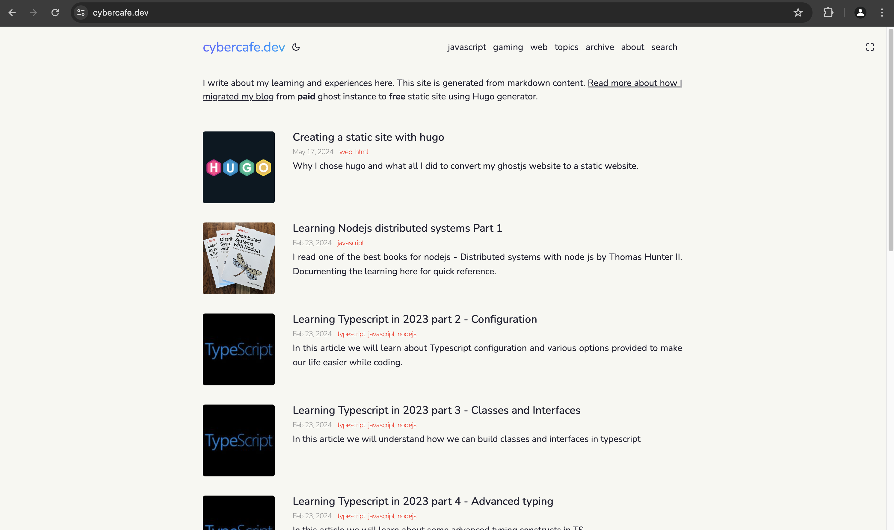
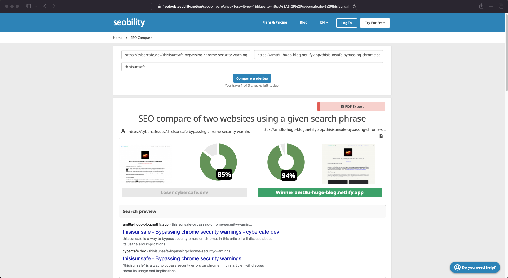
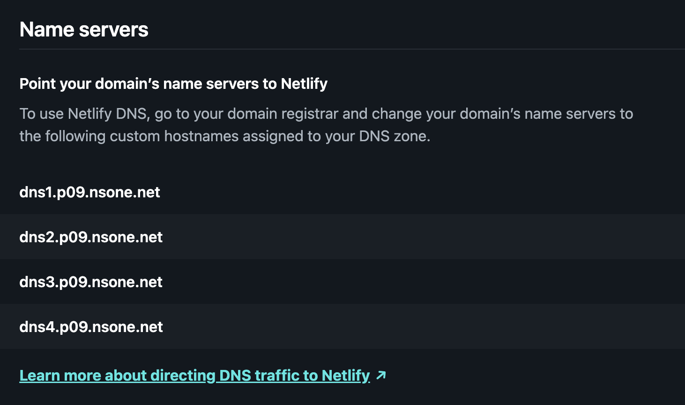
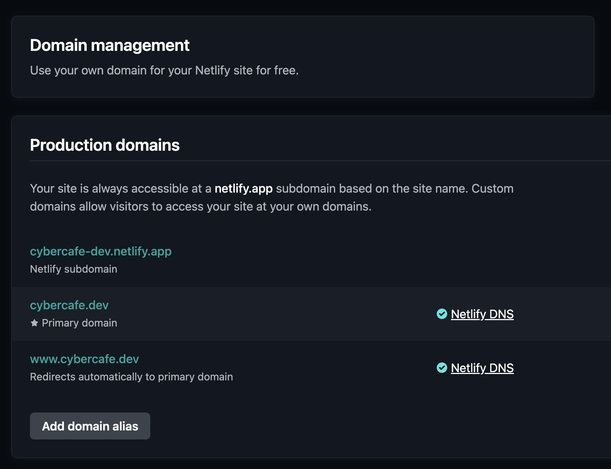
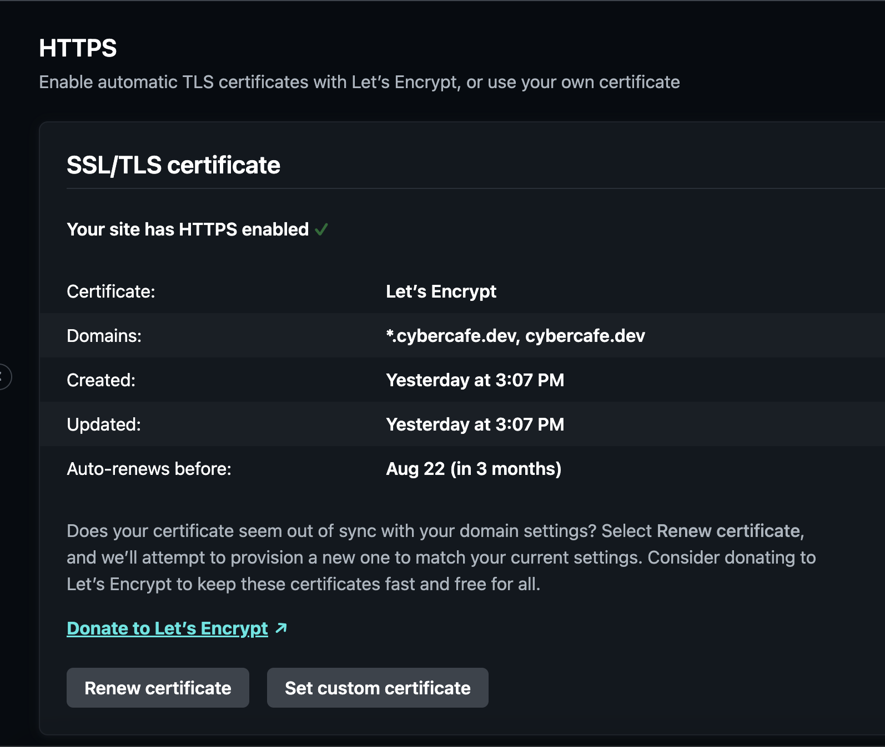
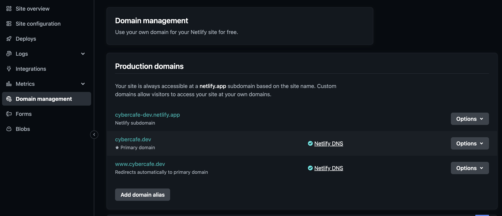

# Cybercafe 2.0 is live



Finally, I have migrated my blog from Digital ocean droplet to Netlify static files. It feels fresh with better looks and features.


# Why?
Well, there were a couple of strong reasons.

* **Money** - Well it depends on the use case. I created the website to learn about hosting and VPS based instances. Now that I can host the complete blog using static files, I no longer need a VPS for my website. Definitely I will lose out on a few things like
  * Running custom code - When you own the server, you virtually run anything inside it. But again, the problem was with Ghost running in background, I couldn't run other big apps. Tried running an Elastic instance, but it needs more than 1 GB of ram just to get started.
  * Analytics - Since it's your server, you can read the access logs and can run analytics on top of that. So even without Google Analytics, I could see performance for my site using a tool [GoAccess](https://cybercafe.dev/setup-simple-analytics-for-ghost-blog-using-goaccess/). Now with static sites, you have to depend on your provider which in turn would demand money. But I guess, I don't need that right now.
  * Running custom apps - Initially I thought that I will use that server to create some magical apps on Node.js, but couldn't get time for that. I do have things in my mind, but I guess a better alternative would be AWS EC2 as it will be cheaper and also easy to manage.
  * Ghost Members - Ghost membership based system was introduced after I started using GhostJS. It is good to have a feature like this, but I am not yet famous enough to have members
* **Security** - The other reason is maintenance. Since you own the server, it becomes an overhead to keep it updated all the time. I could see that hackers try to exploit your site as much as possible. I can see hundreds of 404 requests coming in for various urls like `/admin`, `/login` etc. Although GhostJS is fairly good in terms of preventing these attacks as most of it is targeted to php based sites, but still there is always a chance of someone exploiting a vulnerability in your server. With static sites you are just totally safe.  

In my previous post [Creating a static site with hugo](https://cybercafe-dev.netlify.app/creating-a-static-site-with-hugo/), I listed all the steps needed to be done to convert the site from GhostJS to **Hugo**.

You can deploy and see the site in production using a netlify subdomain. Once you are happy with the overall performance, it's time to say goodbye to **Digital Ocean**. 

But before switching over there were a few things which I needed to confirm.

# Testing
A lot of testing required. If not all pages, at least the popular ones needs to be tested. The areas for testing are generally

* Visual appearance
* Broken links
* Image loading
* Page performance
* `meta` tags 
* SEO related issues
* Page links

It took a lot of time to test the site for all the above-mentioned points. Visual appearance may not be an important thing for crawlers, but SEO related issues do impact search results.

There are some online tools which can read your site content and can give you side by side comparison. I compared my existing live site with the netlify deployed one.



There were few tweaks needed to get a good score. Full report can be found [here](docs/cybercafe.dev-vs-amt8u-hugo-blog.netlify.app.pdf)

* Feature images should have related names
* Alt text having page title 
* `title` to be set on images too
* Twitter meta tags. I had to enable twitter images via params
```toml
[params]
	twitter_cards = true
	images = ["amt8u_logo.png"]
```

# DNS Change
Once you are satisfied, you are ready to move the site to main domain. You need to update the `DNS` (domain name servers) so that your domain points to your new host.

Goto Netlify domain management. You will see the DNS servers. Copy these and then goto your domain provider. 



In my case the domain provider is namecheap. On the control panel, replace the digital ocean DNS servers with netlify ones.

Now you should see status as `Awaited` in the Netlify domain management page.

```
amt8u.netlify.app -> netlify subdomain, automatically points to correct location
cybercafe.dev -> awaiting external DNS
www.cybercafe.dev -> netlify dns
```

Apart from this, two things that Netlify does automatically for you
* Set up redirection for `www` subdomain.



* Automatic SSL certificate using `https://letsencrypt.org/`



Once everything is setup, you should see the DNS setup screen as below


# Wait for a few hours
Generally it takes up to 24 hours to reflect the change as DNS entries are cached at various levels. In case you are eager, you can clear your system DNS cache to see if new DNS information is available.

For macOS the command is

```bash
sudo dscacheutil -flushcache; sudo killall -HUP mDNSResponder
```

# Hit it!
Once DNS change has been propagated, you should be able to see your new site on your domain.

# Sanity
Give one round of quick testing to see if pages are loading fine. Specially the ones which are popular.

> End


