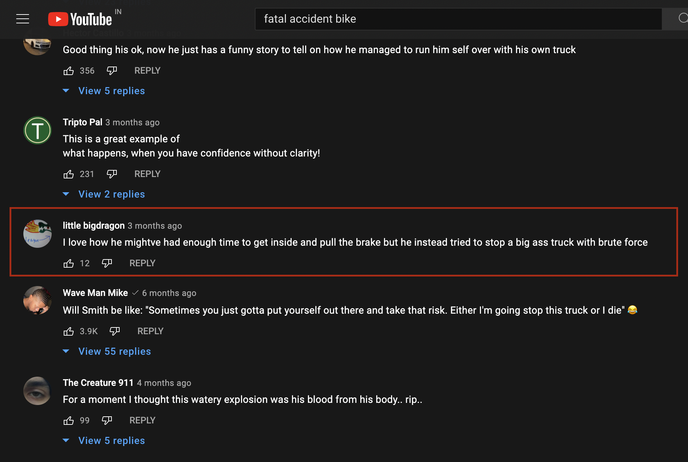
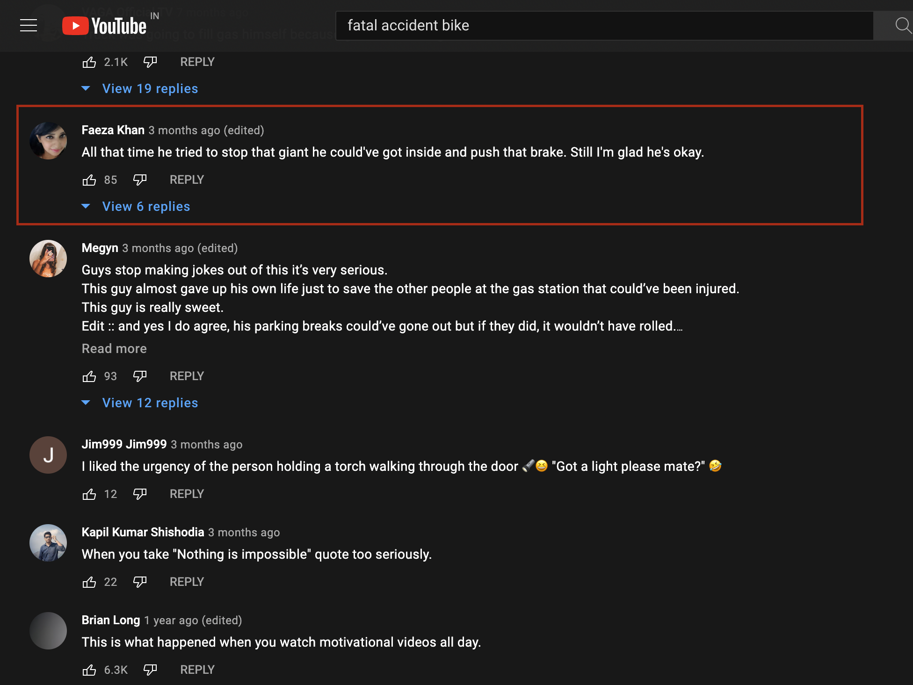

# The problem
People often watch various videos on social media platforms and complain about those who can be seen in it but not helping the victim.

Generally the comment is in one of the forms of 

> "Instead of recording, the person could have helped"

> "Why is nobody helping the guy"

> "All are just spectators. They should be put into jail"

Same is true for other kind of videos where people are attacked by someone and nobody is helping in the situation.

In this article I would like to stress a very important point about such videos. I don't know whether there is already a name for this but I call it the **contextual bias**.

# Understanding the problem
We have to understand that watching a video in [hindsight](https://dictionary.cambridge.org/dictionary/english/hindsight) is totally different than being there in the situation.

Even before starting the video you already have read the **title** and possibly a detailed **description** which sets a `context` for you. This is mostly true for all videos which are shown on news channels. You are already aware of the end result of the incident while watching the video which makes it a totally different kind of experience.

# YouTube comments
A good example of this can be seen in this video [Driver run over by own truck after trying to stop it using his body](https://www.youtube.com/watch?v=V9Rj4v0knL0&list=PLUtUP1YZ8ZHRf7wDwfDebWb8X-eAA7uiD&index=24). Lot of people commenting saying that instead of jumping in front, he could have easily climbed up in the truck and used the brakes. 

When you are done watching the video, adding a comment like this is way easier said than done. When it is happening in real life, you get into a panic situation and might not be able to react efficiently. People are not trained to handle extreme situations such as panic braking, brake fail, steering malfunction, vehicle rolling back on hill etc. When this happens, your instinct comes into picture. If you have not practiced it enough, you will not be able to act(or react if you prefer) properly.

# Courage at its peak
Another great example is this video https://www.youtube.com/watch?v=ytIg0bYnBDc. Try watching it without reading the title first. Things happen so fast that you do not get time to think.

Though the video is 3 minutes long but everything happened in just 10 seconds from 1:00 to 1:10. Here is the list of my detailed observations for that time period.

* `0:58` - Everything going normal
* `1:00` - Boy fells while walking
* `1:01` - Guard sees the boy falling
* `1:02` to `1:04` - The guard sensed the situation, starts moving towards the boy slowly simultaneously judging if he can make it or not.
* `1:04` - He made the judgement and starts running on the tracks **TOWARDS** the oncoming train. A very important point here - Judging the speed of an incoming train when you are in front of it is almost impossible. It looks very slow but as the train approaches you, you realize its momentum. This guy somehow managed to make the right judgement at the right time. In the same situation, I would have been just a spectator and infact I might have ran away to save myself from the after effects if any.
* `1:06` - This is the time he is running on the tracks. If you have ever been on indian railway tracks, you know how they are. Keep aside running, its even difficult to walk. You may sprain your ankle or you can even slip because of all the **#hit** thats there on the sleeper bars. 
* `1:07` - I cannot say for sure, but at this moment it feels like the guy was in dillema, whether to be on the left hand side or right hand side of the track. He didn't know what could be the best position. Maybe he might not be able to save the boy, but should be in a position to abort the run and dive safely on right side.
* `1:10` - He reached the position but at this point his heart might be pounding like a machine gun. He doesn't know the condition of the boy. Maybe the boy is stuck somewhere. Maybe the boy's clothes might be stuck in the tracks. It might take some time to untangle if that happened. Also if you see, the lady was not helping in any way. At this moment you cannot understand why the lady was just waving her hands inspite of lifting the boy. It was later understood that the lady is blind and was not able to judge the situation(another contextual bias)
* `1:11` - The way he jumped over the platform and drifted himself away in the opposite direction shows how desperately he wanted to just get out of the tracks.
* `1:13` - The point of realization that he has saved the boy. But the story is not yet complete. He doesn't know if the boy is completely ok. Whether he is injured or not. Why the lady was not helping. All these questions will be answered in next few moments. From here onwards its just reconciliation.

# The realization
Now coming back to the topic, we have to realize that this context and details were not available when the incident was occuring in real life. It takes time to understand whats going on and realize whether you could be of any help. 

Yes watching with context makes it easy to understand the situation but prevents us to analyze it from a neutral perspective.

# Without context example
A good example of context-less video is https://www.youtube.com/watch?v=1HuzjOeSteE. The title does not give any info as what happened and what was the result. Though knowing the channel makes it slightly easier to guess what would happen in the video.

# What should we do
There is not much that we can do. We just need to understand and stop blaming others.

> End

