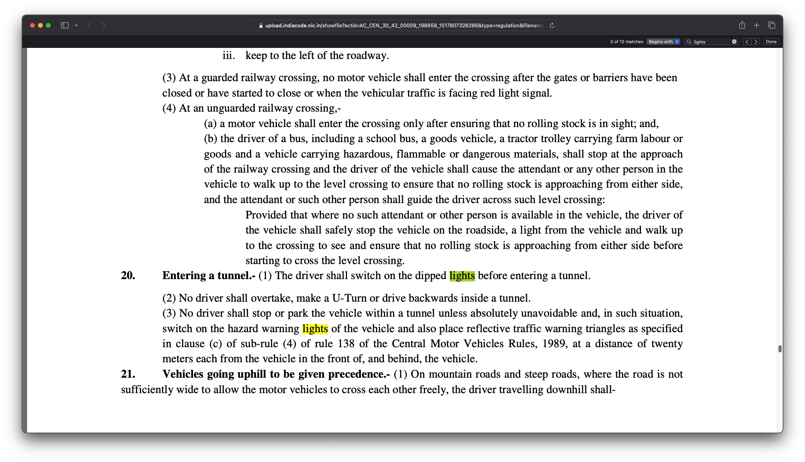
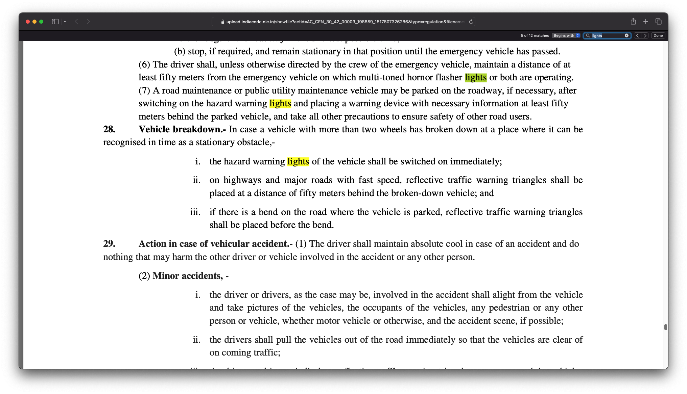
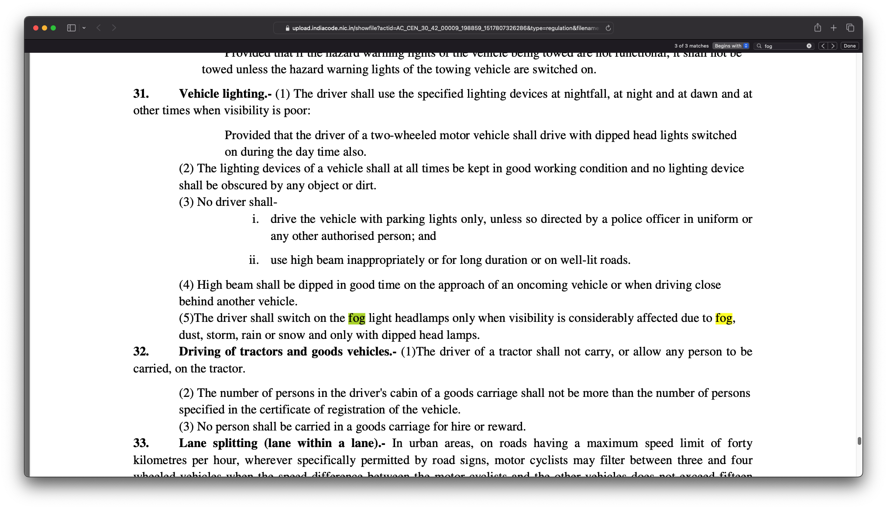

# The confusion
I have seen very often people using Hazard lights(both turn indicators flashing simultaneously) to indicate multiple scenarios while driving. A quick search gives many articles and questions related to same.

https://www.reddit.com/r/CarsIndia/comments/15g4xth/using_hazard_lights_while_driving_in_rain/
https://www.reddit.com/r/CarsIndia/comments/10qn5mz/using_your_hazard_lights_to_indicate_youll_go/
https://www.reddit.com/r/mumbai/comments/vglmhr/hazard_lights_on_cars/

The most common concern is, people tend to use HL in many circumstances where it's use is ambiguous - `Parking` on road, going `straight`, going into `tunnel`, low `visibility` etc.

I have read numerous articles and have seen many Insta/YouTube videos about the same. People recommending to change the hazard light usage and then everyone else fighting in the comments section with their experience. A few observations are :

#### Using HL in tunnels
If everyone uses HL inside tunnel while moving, but your vehicle breaks down, how will you indicate that you are stopped? Some counterarguments suggest that you should use a reflector some distance away for the vehicle. But then reflectors are not reliable enough and can easily fall. And also it takes time and effort to put it. You need something which is instant.

#### Using HL in low visibility
Some people advise using HL in dense fog. A counterargument is again on similar lines, if you use HL while moving, then again you don't have an option to represent when your vehicle is completely stopped while it's still dense. However, if the fog is dense enough that tail light is not visible from a distance, then probably you should drive at like snail's speed maintaining a safe distance which enables you to see the tail light of the front vehicle. In case that is not possible, you need to pull over and wait.

#### Using HL to indicate straight movement
There are instances when I see people recommending to use HL to show that they will be moving straight and do not have intention to turn. While we can see that it could be a good gesture, but feels redundant. You don't need to indicate that you are going straight. Whether it's a multi-lane highway or single lane city road, by default, its assumed that in case of no turn indicators, the vehicle is going straight.

#### Using HL to indicate reverse
Yup, that's also common. Mostly all cars have white reverse indicators, but again, the problem is with commercial vehicles. They don't have reversing lights, and thus they fall back to HL to indicate that they are reversing. Based on the location, the lane, co-driver's position on road, you have to judge whether it's a breakdown or they are reversing.

#### Using HL to indicate parking
Of course, it's known to everyone that you are not supposed to park on the road and thus, using an indicator for that makes it incorrect too. But then again almost every road in every market there is no space for car parking. For a quick 5-min shopping, you might have to spend half an hour parking and come back. To avoid this, people generously use HL to indicate that they are temporarily blocking the road, but you are free to go around. Generally I see that it's acceptable by everyone unless you are becoming a bottleneck.

#### Using HL to indicate towing
I also see that people switch HL on when the towed vehicle's rear wheels are down. Maybe because the towed vehicle obstructs the towing vehicle's light. 

#### Using HL to indicate very slow approach
Sometimes people use HL to indicate that they are going very slow. Maybe their vehicle is not working properly or maybe the road in front is damaged(which is quite frequent in India).

I tried to search for rules around it and here are my findings

As per the [Motor Vehicles (Driving) Regulations, 2017.](https://upload.indiacode.nic.in/showfile?actid=AC_CEN_30_42_00009_198859_1517807326286&type=regulation&filename=G.S.R.634(E)%2023.06.2017%20rules%20of%20road%20regulation%202017.pdf) you need to follow below guidelines

You can check out all the rules on official India repository

https://www.indiacode.nic.in/handle/123456789/1798?sam_handle=123456789/1362

Well there are also various ammendments too, but I wasn't able to find anything related to lights in those.

# That means majority is wrong?
It's clear from the above points that you don't need to use HL when moving. Whether it's a tunnel or fog, there are other ways to indicate that your vehicle is there on the road. In the tunnel, you need to use parking lights. In case of fog, you need to use fog lamps and parking lights.

But then we should also give some thought on the real world challenges. Let's discuss the practicality of Indian conditions. I have seen that majority of commercial vehicles do not have proper lights. Sometimes the lights are covered with dirt, sometimes they are just broken. In fact, on big buses, the tail lights are as small as toys have. I don't know who approves these kind of design. On one hand, even the smallest of cars have 1 foot long light with almost every car having a third center brake light, while on the other hand, big buses and trucks have 4cm round lights which are hardly visible from distance. And sometimes the lights are just dead and driver is unaware of this. Actually nobody cares enough about tail lights in India. If you go and complain about tail light not working, probably the driver will say - "Toh samne dekhke chala na..."(Then look ahead and drive).

But somehow we do give importance to hazard lights. Maybe because they are used in the most dangerous situations like making a random U turn, parking on a curve, reversing on highway to goto the service road:-P etc. And thus people do tend to keep the hazard lights in working condition. They also make sure that dirt is not covering these lights.

And that's why hazard lights are more reliable and people try to use(you can say abuse :-D) them in every other situation where they feel that they are doing something unusual. Whether its legal or illegal, is a different aspect. It's a way to say - Be cautious near me! I am doing something which may not be allowed.

# Cause
While we are getting better day by day, but these sort of issues come primarily because of mass acceptance of such kind of behaviour. If everyone follows, it kind of becomes a de facto rule. Most of us learn from our acquaintances with practically zero training in terms of rules and laws. Another reason could be lack of features in affordable and budget oriented vehicles. 

# Conclusion
With the present road conditions, lack of infra, poorly maintained vehicles(because of various reasons), I believe the best way is to find a balance between the actual purpose and the real world usage.

In theory, you have to always maintain a sufficient distance from the front vehicle, but is not possible practically, Just like that we need to adapt to the situation. We need to mix and match depending on the circumstance.

Obviously, it would be better if everyone follows the common rule, but that would come only when we have trainings in place and properly maintained vehicles.

# References
While we are on the subject, here are a few links to some quick references
Rules/Acts on Morth - https://morth.nic.in/motor-vehicles-act-1988
India code Motor Vehicle act - https://www.indiacode.nic.in/handle/123456789/1798?sam_handle=123456789/1362
Road safety guidelines - https://morth.nic.in/sites/default/files/road_safety_books.pdf
