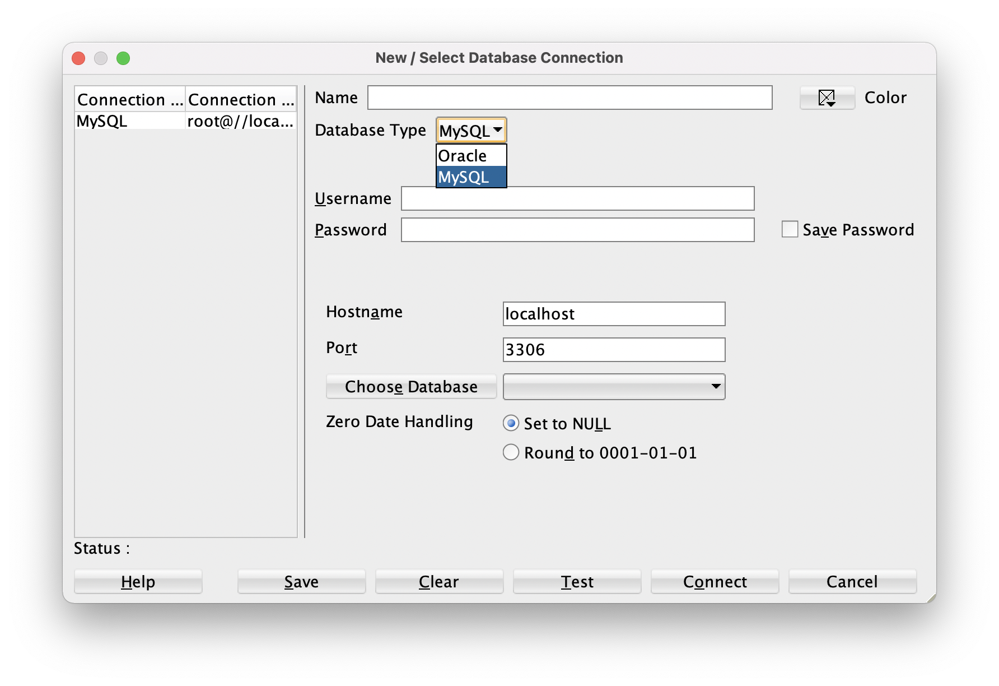
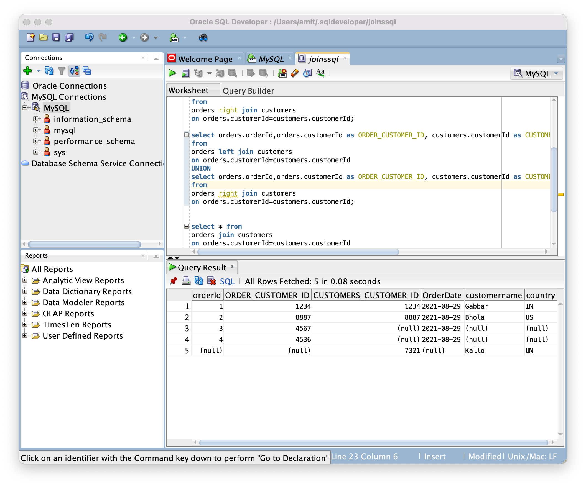
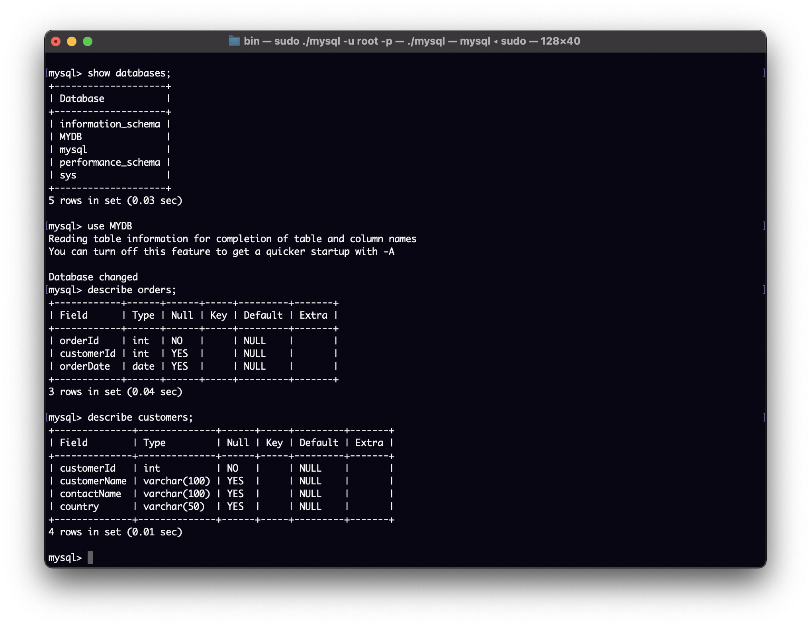

# Excerpt
Here is a mini guide to setup Mysql server community edition with oracle SQL Developer on MacOS.

# Why
Recently I wanted to refresh my **SQL** skills and needed a basic database setup on my Macbook Air. I remember from my school days that we could install oracle 6/7 free versions for personal use. Apparently oracle no longer offers free versions. Instead it(Oracle) now gives us `mysql` which is essentially the free one thereby eventually leading me to refresh not just "my sql" but "mysql" skills as well.

# MySQL
Download mysql server community edition from mysql website.
[MySQL](https://dev.mysql.com/downloads/mysql/)

# JDK
To run the SQL developer, you will need java on your machine. You can download JDK from [Oracle](https://www.oracle.com/java/technologies/javase-jdk11-downloads.html)

# SQL Develoepr
Get it from [Oracle](https://www.oracle.com/tools/downloads/sqldev-downloads.html). You will need a free oracle account to register and download java and sql developer.

# Connector setup
Now that we have all the required software, we need to connect our SQL Developer instance to mysql instance. By default SQL dev supports connecting Oracle DB. YOu just need to provide connection details. But for `mysql` you need to add support.

Download the mysql connector from [Oracle-Base](https://oracle-base.com/articles/mysql/mysql-connections-in-sql-developer)

Perform the steps as mentioned in the article. For easy access, I copied the steps here as well.

* Download the latest "JDBC Driver for MySQL (Connector/J)" from [here](https://www.mysql.com/products/connector/). Click the "Download" link next to the "JDBC Driver for MySQL (Connector/J)", then select the platform independent version and download the zip file.

* Unzip the connector. The resulting directory contains a "mysql-connector-java-8.0.23.jar" file.

* Open SQL Developer and navigate to "Tools > Preferences > Database > Third Party JDBC Driver".

* Click the "Add Entry..." button and highlight the "mysql-connector-java-8.0.23.jar" file and click the "Select" button. You may need to place the driver file in `.sqldeveloper` directory since it might not have access to other directories. You can always change the access from preferences though.

* Click the "OK" button to exit the "Preferences" dialog.

* When you create a new connection, the "Database Type" dropdown includes a MySQL option. On older versions of SQL Developer this used to appear as a tab. Enter the connection details and test the connection.



# Connect SQL Developer



Now we are ready to connect. Create a new connection and provide below details.

* username - root
* password(as given while setting up mysql)
* connection URL and port(by default localhost:3306)

Just some helpful text from the article
> If the user chooses to not start MySQL during startup, then either launchctl from the command line should be used or start MySQL by clicking "Start" with the help of the MySQL preference pane.

Once you are connected, you can now create new sql worksheets and start working with mysql. Do note that not all features are supported. You will find the commit button disabled in SQL Developer.

And a few commands also differ like creating and selecting the databases.

# MySQL command line



By default mysql binaries are not added to PATH. So you won't be able to run `mysql` in the terminal from anywhere. You could navigate to the mysql folder and run mysql command line from there or you can add it to your PATH.

Goto mysql folder

```bash
cd /usr/local/mysql/bin
```

Execute mysql, enter root password you entered while installing mysql setup

```bash
sudo ./mysql -u root -p
```

Related info available on stackoverflow question [here](https://stackoverflow.com/questions/30990488/how-do-i-install-command-line-mysql-client-on-mac).

# Data setup for practice
If you are new to SQL and would like to setup some fake data for practice, read this section.

### Create database
In mysql you need to create individual database before creating any tables.

Create a database called order_system.
```sql
CREATE DATABASE ORDER_SYSTEM;
```

Select the database to perform operations on it.
```sql
USE ORDER_SYSTEM;
```

Create some tables
```sql
create table orders (orderId INT NOT NULL, customerId int, orderDate date);

create table customers (customerId INT NOT NULL, customerName VARCHAR(100), contactName VARCHAR(100), country VARCHAR(50));
```

Insert some data
```sql
insert into orders values(1, 4567, CURDATE()); 
insert into orders values(2, 8887, CURDATE()); 
insert into orders values(3, 8761, CURDATE()); 

insert into customers values(4567, 'Gabbar', 'gabbar@gmail.com', 'IN');
insert into customers values(1234, 'Bhola', 'bhola@gmail.com', 'US');
```

Select some data
```sql
select * from orders where orderid = 2;
```

Use joins to combine data from multiple tables
```sql
select orderid, orders.customerId, orderdate, customername from orders join customers
on orders.customerid = customers.customerid;
```

Just a point to note that mysql [does not supports full outer join](https://stackoverflow.com/questions/4796872/how-can-i-do-a-full-outer-join-in-mysql). More info [here](https://dev.mysql.com/doc/refman/8.0/en/join.html).

Possibly because its not required as much as other features as [pointed out by people](https://stackoverflow.com/questions/3362079/is-there-a-reason-mysql-doesnt-support-full-outer-joins).

> End

