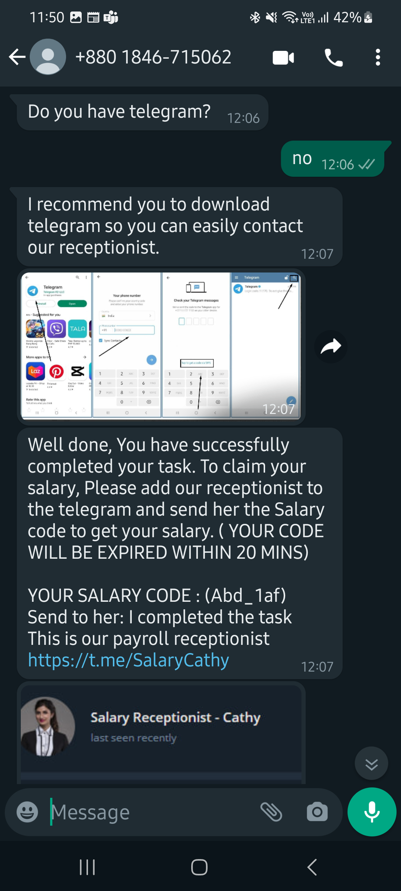
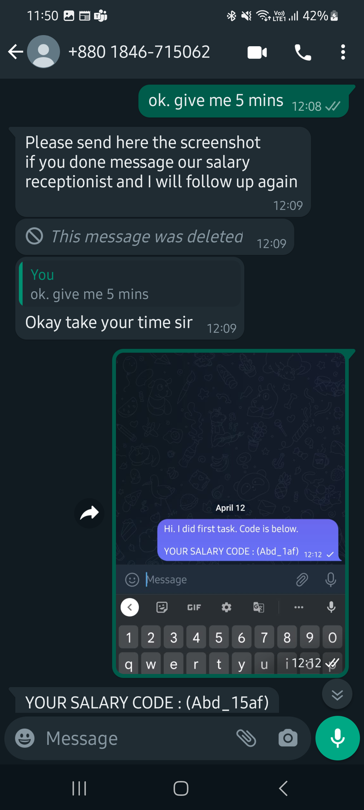
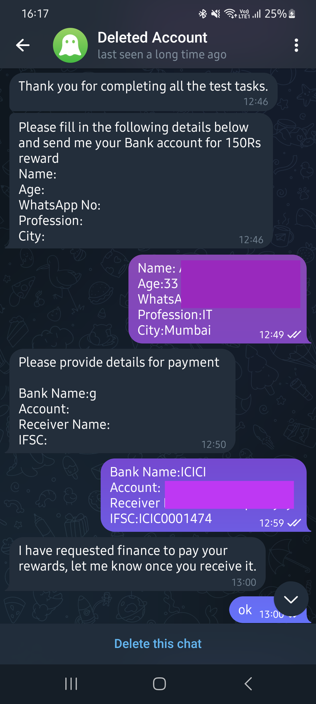
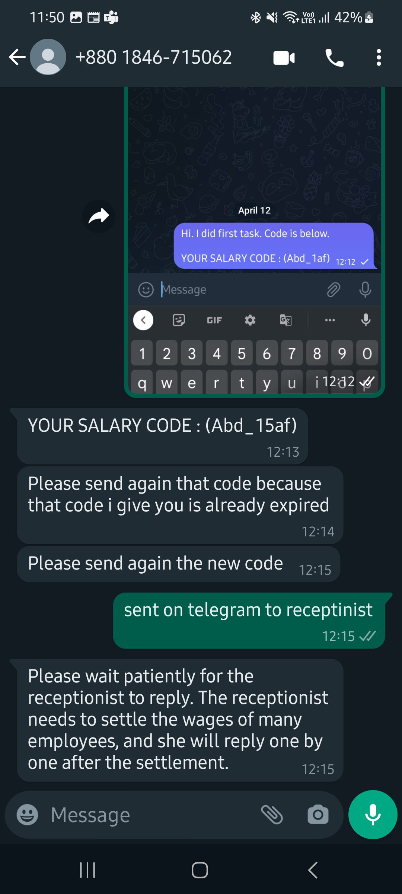
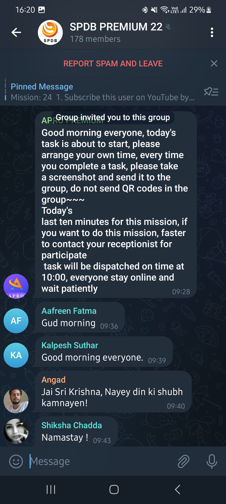
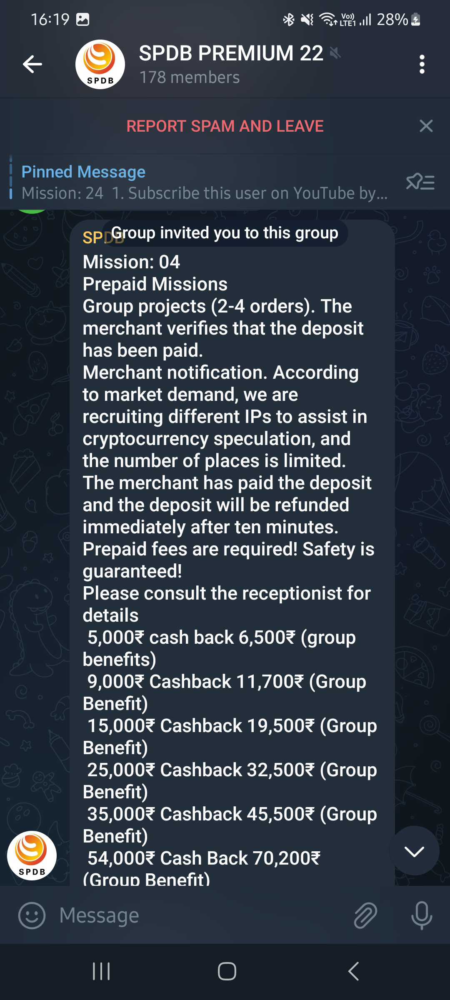

# Excerpt
In this article I discuss about the modus operandi for the ongoing Work from home scam which is mostly targetted to urban people.

# New scam
In this article I want to discuss about a new scam in the market. Of course there are hundreds of scam running online now a days, but what makes this new scam special is that even IT guys are getting scammed by this.

Here is my first hand experience with some observations as why tech people are also falling for the trap.

# How it works?
### They will first approach you with a genuine looking message from some HR about a part time job.

First connection           |Task objectives 
:-------------------------:|:-------------------------:
 | 

* Notice how they are using a well known company name (PUBLICIS) which also sounds like it's related to advertising business.
* The earnings that they show initially is in the range of `Rs. 150-5000`. You will see later that you can even earn in lakhs, but still in this initial phase they are keeping the returns under Rs 5000 which feels a legit for a part-time job.
* Rs 50 per task and `Rs 5000` for 100 tasks feels somewhat believable

### Are the tasks doable?

* Looking at the YouTube trends and knowing that genuine likes and views actually help in marketing, this seems to be a believable business. Even though we understand the like is kind of a fake one, but getting Rs50 for just one like looks very lucrative.
* Upto this step I thought that this is some kind of marketing agency trying to get genuine likes on channels to promote them. So I wanted to check how do they verify if you really completed the task or not. They ask for the screenshot to check that you really liked the video. But a thing to note here is that this kind of verification isn't full-proof. I can always take the screenshot with the like and then after taking the screenshot I can remove the like(:-O). That's when I realized that this is not just a marketing job and the objective of these tasks is something else.

### First salary
Telegram | Salary
:---:    | :---:
 | 

* Once you are done with the task, they ask you to move to telegram where you will connect with another person(whom they call receptionist) who will process your salary(`Rs 150 for 3 tasks`)
* At this point I was thinking that probably the telegram guy would ask me to install an app or maybe initiate a UPI transfer etc. just like our regular OTP based scams.
* But to my surprise they just asked my account details with IFSC code.

Account Details | Waiting for confirmation
:---:           | :---:
 | 

### Payment received
* Soon I received a message stating `Rs.150` has been credited. At first, I thought maybe they are mimicking the Bank credit messages and just sent me a fake message mentioning a fake credit to account. The message did include the account number, but I only provided them so that's not something I can vouch for.
* I checked my account statement, and I was surprised to see `Rs. 150 credited`. At this point I was a little perplexed and started believing that maybe it is indeed an authentic job.

### The Telegram group
Once you confirm that you have received your payment of Rs. 150, they will add you to a telegram group.
The telegram group will have many people who are continuously doing the tasks and posting proofs of their tasks. The admin will post a message around some easy tasks and will pin those messages. After one or two rounds the admin will post a different kind of task called as `Prepaid Missions`

Starting missions   | Mission Description
:-----------------: | :-----------------:
  | 

* This was the first point when it struck to me that this is a scam. They request you to pay money to continuously do the tasks.
* Given the number of options which `start at Rs 5000 and promise Rs 6500 in 10 minutes`, you will think that the risk is quite low
* Although I didn't go this far and did not participate in the paid tasks, but here are my thoughts what would happen next if I would have went through

# The bait
### You see others posting about their credits being received

Credit messages | PhonePe receipts
:---: | :---: 
 | 

* Now once you have enough trust and looking at others receiving money you will also pay Rs. 5000 for the next tasks to start with. And in turn you will get Rs 6500 back into your account soon. That's when the trust meter goes high
* Because you get the returns directly into your account, you start believing this project and would try your hands with a higher amount, maybe Rs 9000 next time?
* You may get returns up until a certain amount like maybe Rs 50000 but soon when you transfer a big amount like Rs 2.5Lakhs, you will stop getting returns.
* You will try connecting them and ask for payments, but they will in turn give you reasons of blocked payments which would require additional investment from your side. 
* Now that your money is blocked and you still feel that its a legit business, you will arrange more funds and transfer to them.
* And this is when you realize that `you have been scammed`. Since they connected with you via whatsapp and telegram, there is no way to connect back to them. They can simply block you on these platforms. Obviously you can't complain to whatsapp or telegram because they won't entertain you. They will remove you from the groups and you will have nowhere to go.
* Since you transferred the money by yourself, the bank will also not help you as there was nothing wrong from their systems. Its not a hack right!

### Where to complaint?
Unfortunately, as its with other online scams, there are very low chances of getting your money back. 

The people who are doings these kinds of scams could be sitting in a completely remote city. And you know how in effective our police is when it comes to online frauds. There is just not enough machinery in our systems which can catch these criminals.

All the 150 members in the telegram group could be fake. You don't see their phone number and thus you cannot connect with them personally and even if you can, you have no way to identify whether he is a real person or one of the scammers.

Even if you complained about this to the police, there is nothing much they can do, since the police cannot trace the users unless the app themselves gets involved in investigation which is not possible since the app servers are outside India and nobody is going to initiate an international investigation for you.

There are portals where you can report online cyber frauds, but again it won't help getting your money back.

# What's special in this scam?
The unique thing about this is that you really get `paid`(Sometimes!) after completing the jobs. Once you complete the tasks given to you, they really pay you money in your back account which is enough to build the trust for some people. In fact they may pay you in thousands. Think of this as an investment from their side. Even if you catch them at a stage where they are paying you, they will only lose a few thousands, but scamming innocent people daily they might be earning in crores monthly.

# Solution?
The only solution for this is to just ignore these work-from-home jobs altogether. Yes there are legitimate jobs, but there are proper channels through which you should apply for and work. And yes, remember there is never an easy way to make money online. Specially not by liking or subscribing videos.

# Here are a few events that happened recently. 
* https://www.indiatoday.in/technology/news/story/a-pune-based-it-professional-lost-over-rs-1285-lakh-in-online-scam-2359715-2023-04-13
* https://punemirror.com/pune/crime/pune-two-more-it-professionals-duped-for-rs-14-lakh-cybercrime-series-continues/cid1683349985.htm
* https://www.timesnownews.com/mirror-now/crime/pune-it-professional-duped-of-rs-8-25-lakh-by-cyber-fraudsters-on-pretext-of-offering-job-to-give-online-reviews-article-98434455
* https://www.thebridgechronicle.com/pune/pune-it-professional-from-hinjewadi-loses-whopping-rs-26-lakh-in-online-gift-scam

> End