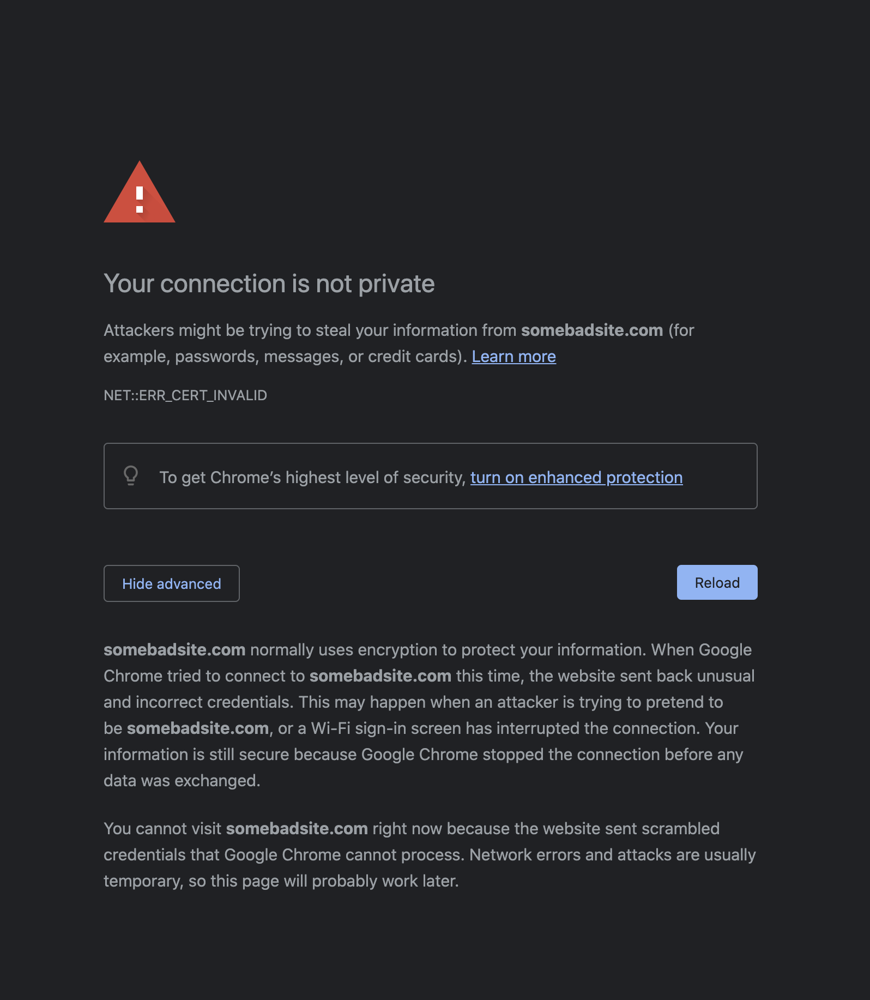

# Excerpt
thisisunsafe is a way to bypass security errors on chrome. In this article I will discuss about its usage and implications.

# SSL Warnings
Major browsers present you with a warning when you try to visit an insecure site. Even if the site is served with the secure url `https://`, the security depends on the certificate issued to the site and not whether the site is configured on port 80 or port 443.




There can be hundreds of reasons where your certificate goes invalid. For eg.
* **Certificate expired** - Generally all SSL certificates have a expiry date even if you have purchased them. In most paid systems, they auto-renew while in free services you might need to manually renew them. Until then your visitors will receive a warning that your site is not secure.
* **Insecure links** - Even if you have a properly working certificate for your site, some links on the site(images etc.) might not be using the `https://` scheme which in turn will make your site insecure.
* **Unknown Certificate Authority** - These are the organisations which have already setup their network. Browsers are aware of them even before you install them. If you configure your own CA, maybe for a local network in an organisation, browsers would not rely on you, so they will still give SSL errors even if the ceritificate is configured properly.

# thisisunsafe - bad idea?
As you can see, these are just warnings. Some browsers will let you go through after clicking on the `Accept and Continue` button. In some situations Chrome doesn't even present you with a `Continue` button. For those circumstances though, there is a bypass available. You can just type in `thisisunsafe` anywhere on the window and the browser will let you visit the page.

The bypass adds an exception for that particular domain to chrome's internal memory. You can remove the exception by clicking on the padlock icon and **Re-enable Warnings** link. Same is true with Firefox albeit with slight change in the UI etc.

The bypass has been put deliberately by the chrome dev team just for testing purposes. This can be seen in the code as well inside [handleKeypress()](https://chromium.googlesource.com/chromium/src/+/master/components/security_interstitials/core/browser/resources/interstitial_large.js) function.

```js
/**
 * This allows errors to be skippped by typing a secret phrase into the page.
 * @param {string} e The key that was just pressed.
 */
function handleKeypress(e) {
  // HTTPS errors are serious and should not be ignored. For testing purposes,
  // other approaches are both safer and have fewer side-effects.
  // See https://goo.gl/ZcZixP for more details.
  const BYPASS_SEQUENCE = window.atob('dGhpc2lzdW5zYWZl');
  if (BYPASS_SEQUENCE.charCodeAt(keyPressState) === e.keyCode) {
    keyPressState++;
    if (keyPressState === BYPASS_SEQUENCE.length) {
      sendCommand(SecurityInterstitialCommandId.CMD_PROCEED);
      keyPressState = 0;
    }
  } else {
    keyPressState = 0;
  }
}
```

You can see that the keyword is put as a base64 encoded string. [`window.atob()`](https://developer.mozilla.org/en-US/docs/Web/API/WindowOrWorkerGlobalScope/atob) converts it to ASCII. If you are curious, there is a function `window.btoa()` that converts ASCII to base64.

```js
window.atob('dGhpc2lzdW5zYWZl')
"thisisunsafe"
```

Earlier this bypass keyword was used to be `badidea`, but they updated it as its been taken as a method of abuse. This is noted in the [commit here](https://chromium.googlesource.com/chromium/src/+/d8fc089b62cd4f8d907acff6fb3f5ff58f168697).

```
Rotate the interstitial bypass keyword

The security interstitial bypass keyword hasn't changed in two years and
awareness of the bypass has been increased in blogs and social media.
Rotate the keyword to help prevent misuse.

Bug: 797344
Change-Id: I76213b05cc0fe8f23882123d0aeef668652dd89d
Reviewed-on: https://chromium-review.googlesource.com/860418
Reviewed-by: Adrienne Porter Felt <felt@chromium.org>
Commit-Queue: Eric Lawrence <elawrence@chromium.org>
Cr-Commit-Position: refs/heads/master@{#528371}
```

Here is the [stackoverflow answer](https://stackoverflow.com/questions/35274659/when-you-use-badidea-or-thisisunsafe-to-bypass-a-chrome-certificate-hsts-err/35275060#35275060) by [Barry](https://stackoverflow.com/users/2144578/barry-pollard) from where I picked up the above info.

The author also suggested to setup certificates properly instead of using the bypass everytime. He also mentioned about a bug where caching does not work properly with SSL errors. While caching issues can be dealt with but SSL errors needs to be taken seriously.

Though you have the bypass available but that doesn't mean you start abusing it. If you are doing testing on your own sites, then its probably fine but applying this workaround on every other site is not a good idea.

# Testing local sites
Chromium project has a [page](https://www.chromium.org/Home/chromium-security/deprecating-powerful-features-on-insecure-origins#TOC-Testing-Powerful-Features) which suggests alternatives to test features which require secure origins.

Here is a snapshot from the page for testing secure origins witthout a commercial CA.

1. Secure the server with a publicly-trusted certificate. If the server is reachable from the Internet, several public CAs offer free, automatically-renewed server certificates.

2. http://localhost is treated as a secure origin, so if you're able to run your server from localhost, you should be able to test the feature on that server.

3. You can use chrome://flags/#unsafely-treat-insecure-origin-as-secure to run Chrome, or use the --unsafely-treat-insecure-origin-as-secure="http://example.com" flag (replacing "example.com" with the origin you actually want to test), which will treat that origin as secure for this session. Note that on Android and ChromeOS the command-line flag requires having a device with root access/dev mode. 

4. Create a self-signed certificate for temporary testing. Direct use of such a certificate requires clicking through an invalid certificate interstitial, which is otherwise not recommended. Note that because of this interstitial click-through (which also prevents HTTPS-response caching), we recommend options (1) and (2) instead, but they are difficult to do on mobile. See this post on setting up a self-signed certificate for a server for more information on how to do this.

5. An alternative approach is to generate a self-signed root certificate which you place into the trust store of the developer PC/devices, and then issue one or more certificates for the test servers. Trusting the root certificate means that Chrome will treat the site as secure and load it without interstitials or impacting caching. One easy way of setting up and using a custom root certificate is to use the open source mkcert tool.

On a local network, you can test on your Android device using port forwarding to access a remote host as localhost.

<hr />

As a side note the warning screens that block you from visiting the pages are called `interstitials`. And the template for this is present in chromium [code](https://chromium.googlesource.com/chromium/src/+/master/components/security_interstitials/core/browser/resources/interstitial_large.html).

> End


